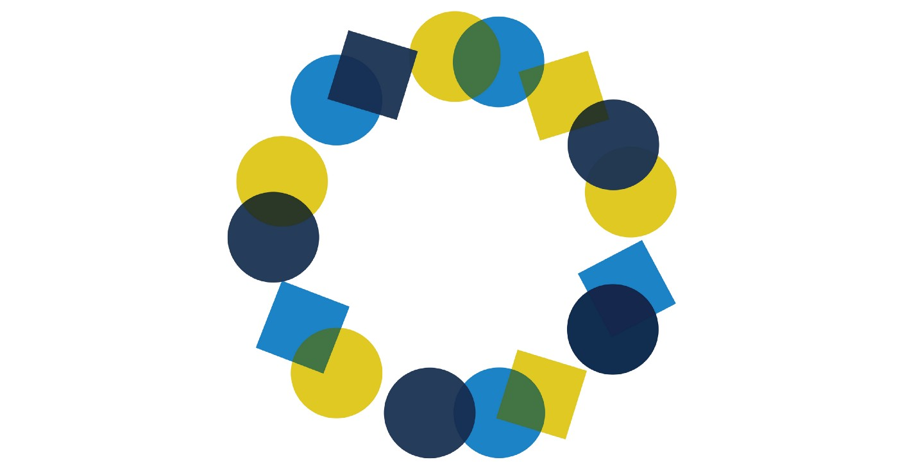

---
# Page template info (DO NOT EDIT)
layout: default
blog_page: true

# Carousel (Edit this)
carousel_title: "A quick guide to inclusive design"
carousel_summary: "Designing for inclusion isn’t just about coding for accessibility or section 508 compliance, it’s about providing equitable and easy-to-use websites and services for diverse populations. Because good design is design that works for everyone."
# partial path to image
carousel_image: /news-and-blog/2022-08-15-a-quick-guide-to-inclusive-design-img/carousel-inclusive-design-card.jpg
# accessibility text for image
carousel_image_alt_text: "Graphics with the quote Everyone benefits from inclusive design"
# should show on news and blog page. ordered by date prefix in filename
carousel_show: true

# Blog detail page (Edit this)
title: "A quick guide to inclusive design"
dateline_str: "Aug 15, 2022"
readtime_str: "9"
byline_str: "Suzanne Chapman - UX designer, researcher, and content strategist at USDS"
permalink: /news-and-blog/a-quick-guide-to-inclusive-design-31ef2c
---

_This post aims to describe a few basic, inclusive design concepts that help guide our projects at USDS but there are many additional resources available for those ready to explore more. (An [older version of this guide](https://medium.com/the-u-s-digital-service/a-quick-guide-to-inclusive-design-16ba41eece89) was published in Dec. 2018.)_

## Who benefits from inclusive design?

Everyone.

Designing for inclusion isn’t just about coding for accessibility or section 508 compliance, it’s about providing
equitable and easy-to-use websites and services for diverse populations. Because **good design is design that works for everyone**.

One of my first user research sessions at U.S. Digital Service was with a Veteran who has Parkinson’s disease. He
apologized the whole session because he had trouble using his computer mouse and kept forgetting our questions — he said
he probably wasn’t the best person to get feedback from. I reassured him that he’s exactly who our site should work for.

This example doesn’t represent an edge case, or extremely rare situation. It’s actually most cases.

If you’ve ever applied for federal healthcare, jobs, visas, student loans, small business loans, rental assistance,
disaster relief, unemployment, or other benefits, you know it can be hard. For some people, it’s just about slogging
through a long application or making sense of dense instructions. But the reality is that most people face additional
obstacles.

Understanding the range of contexts our users come from is key to designing quality government digital experiences.

## We have many different users with many different, and often evolving, needs

The diverse populations we serve have many different abilities, qualities, and aptitudes:

- Vision impairment, low vision, color blindness, contrast sensitivity, and/or aging eyes
- Hearing loss or lacking the ability to hear
- Physical or motor impairment
- Cognitive differences (e.g., neurodivergence, traumatic brain injury, anxiety, and memory loss)
- Past traumatic experiences
- Limited access to Internet
- Range of reading literacy skills
- Range of English language skills
- Range of expectations that can be influenced by cultural experiences
- Range of comfort using technology
- Range of knowledge or experience with a topic or a process
- Different technology access needs (e.g., assistive technology, only using a mobile device)
- Under high-pressure, stressful, or time-sensitive situations

And remember, many of these can be permanent, temporary, or situational. For example, someone may have difficulty using
a mouse because of a permanent condition or because they broke their arm or because they’re holding a child.

Designing for a diverse population can be overwhelming to those just getting started but the good news is that, if you
keep things simple and follow a few key principles, you are already most of the way there.

## Five key principles for inclusive design

### 1. Design with users, not for them

One of the [six USDS values](/mission#our-values) is to “design with users, not for them.” What’s implicit in that is that designing _with_ users means _all_ users regardless of their ability, context, or demographics. We’re designing technology and services for a diverse population so our research participants should be equally diverse. So, not only do we strive to do research with diverse populations, we also strive to make sure our research sessions are inclusive and equitable.

- Include people from the disability community.
- Include people who are non-native English speakers (for English websites and for translated versions of English
  websites).
- Provide sessions at a variety of times, not just during regular working hours.
- Include remote sessions to help get geographically diverse participants.
- Include in-person sessions to help get people who don’t own their own technology.
- Let people use the technology of their choice (e.g., if they typically use assistive technology or their phone to
  access websites, have them test with that technology).
- Keep sessions structured but casual to help establish trust and safety with participants.

It can be hard, especially with small qualitative studies or quick time frames, to get a sufficiently diverse group
including all of the above. Which is why we conduct multiple rounds of research at USDS while designing and developing.
More research means we can get a wide variety of people involved to help make websites and services better for all.

### 2. Use language that’s easily readable, skimmable, and understandable

When people don’t understand the information you’ve presented, they’re more likely to make mistakes, need additional time (which they may not have) to understand or fix errors, miss out on important services, or even fail to complete the task all together.

We can help make the information more manageable by presenting it clearly, covering introductory topics, providing
helpful context, and explaining the benefits of completing the task. When achieved, people will feel more informed,
prepared, and empowered. Here are a few rules of thumb:

#### Keep it simple:

- Be concise. Use short sentences and short paragraphs.
- Use subheadings and bullets to break up overwhelming “walls of text.”
- Stick to information that helps people complete their task. It’s typically not helpful to go into the history of how
  something came about, who’s involved, or the internal organization structure.

#### Use accessible language to help people understand complex information

- Use [plain language](https://plainlanguage.gov/). Avoid jargon, formal, and complex words when simple ones will do (
  e.g., write “use” instead of “utilize”).
- Use action-oriented language, especially when describing steps in a process (e.g., use “fill out an application…”
  instead of “an application can be filled out”).
- Use a “business casual” voice. Be friendly but professional; address users as “you;” and use contractions where
  appropriate.

#### Use inclusive language to welcome every reader and remove barriers.

- Avoid figures of speech and idioms that may be unfamiliar to people without native-English language skills. (e.g., use “sick” instead of “under the weather”).
- Use “they” and “their” as singular, gender-neutral pronouns.
- Avoid terms that may accidentally exclude people (e.g., only refer to your audience as citizens when you are
  specifically referring to people with citizenship status. Otherwise, use something like “people living in the U.S.”).
- Incorporate
  more [inclusive language into forms](https://uxdesign.cc/designing-forms-for-gender-diversity-and-inclusion-d8194cf1f51).
- Consider using people-first language, (e.g., use “people experiencing homelessness” instead of “the homeless”).

#### Provide additional context to help improve people’s subject literacy

- Fill in necessary details to help people understand complex topics or make informed decisions. It’s often not enough
  to use plain language when asking questions on a form. Often, people need to understand what’s being asked, relevant
  information to help them make a good decision, why the information is needed, how it will impact their outcome, or how
  the information will be used.

#### Provide just enough information to help people complete their task

- Start with the basic information that’s needed to complete the task at hand.
- Put helpful information in context of where it’s needed (not in a separate Frequently Asked Questions area).
- Avoid creating “just in case” content. People are often better served by fewer pages that contain the most important
  details, rather than by many pages that are exhaustively thorough.
- For complex topics or very uncommon scenarios, provide a path people can follow to get more in-depth information so
  everyone doesn’t have to sift through text that doesn’t apply to them.

### 3. Design for simplicity, consistency, and ease of use

The best way to delight users of government services is to design experiences that help them get their task done quickly
and easily.

- Keep the design straightforward. Avoid bells and whistles that are more complicated to execute and don’t add a lot of
  value for the users (e.g., avoid carousels, moving images, complex layouts, and PDFs that could be webpages).
- Start with the [U.S. Web Design System](https://designsystem.digital.gov/) and only stray from it when necessary.
- Walk users through complex processes (
  e.g., “[progressive disclosure](https://www.uxmatters.com/mt/archives/2020/05/designing-for-progressive-disclosure.php)”
  to let complex information unfold and “wizards” to present one question at a time that result in a custom message for
  their situation — a great example of this is
  the [VA discharge status tool](/projects/discharge-upgrade-tool)).
- Make sure your text and background colors have good contrast.
- Avoid unnecessary visual graphics or stock photos of little value that clog bandwidth on mobile phones.
- Design to support your content by having designers work side-by-side with the people writing the content. Make sure
  users always know what they need to do next (e.g., action-oriented layouts, noticeable calls-to-action, and numbered
  lists to help guide through complicated processes).
- Avoid creating pixel-perfect designs that break when people adjust the type size on their device.

### 4. Design for mobile first

Designing for mobile before you design for desktop isn’t just about making sure your site looks good on a mobile device.

Mobile design is essential for equity, as [research shows](https://www.pewresearch.org/internet/fact-sheet/mobile/) about 15 percent of American adults depend on smartphones to go online.

Reliance on smartphones is more common for younger adults, people who are lower-income, and lower education levels.

Mobile design principles have a lot of crossover benefits that help people more easily use your site regardless of their
abilities or screen size. And, generally, designing mobile-first will help ensure your content and designs don’t become
overly complex.

#### Here are some of the ways we use mobile-first to further support other inclusive design practices

- Use enough space around clickable elements (e.g., buttons, links, form fields). On mobile, this prevents fingers and
  thumbs from accidentally selecting the wrong thing. On desktop this makes it easier for people who have difficulty
  using a mouse.
- Write your content in the context of a small screen. This helps ensure your content is concise and gets to the point
  quickly. (Tip: if drafting content in a text-based computer application like Microsoft Word, you can simulate a small
  screen by increasing your side margins so you are only using three inches of space)
- When sharing drafts or mock-ups for feedback internally, share them in the context of a small screen. This helps
  counteract impulses by stakeholders, lawyers, and subject matter experts to add tons more content because when you
  show them their longer content on a small screen, the low usability of this becomes unavoidable.
- Remember that internal users benefit from mobile responsive tools too because they may shrink multiple windows down to fit on their screen side-by-side.

### 5. Hire and empower great people

Another one of the [six USDS values](/mission#our-values) is to “hire and empower great people.”

As part of this, we strive to make sure that our own teams reflect the great diversity of the populations we’re serving. And once they’re in place, they are fully empowered and encouraged to do what’s needed to make sure our products are inclusive, easy-to-use, and equitable.

When a team doesn’t have much diversity, it’s important to ask, “Who are we missing? Whose voices do we need to make
sure to hear?” This helps us learn [how to recognize exclusion](https://uxpajournal.org/learning-recognize-exclusion/)
and develop more inclusive practices in our hiring and design process.

**It’s always nice to end with a quote, so here’s one from a user research participant to one of our designers:**

_“As a disabled Veteran it means a lot to me that this type of site is being built up for us! It already appears to be
more user-friendly [than the old site] and that is going to be so helpful for the older, disabled Veterans, like my
father. He is constantly asking me for help. I can start sending him to this site now. Thank you for this
opportunity to help.”_

## Learn more about inclusive design via these helpful resources:

- [Plainlanguage.gov](http://plainlanguage.gov/)
- [Language, Please](https://languageplease.org/)
- [Health Literacy Online](https://health.gov/healthliteracyonline/)
- USDS [Mythbuster’s Guide to Accessibility](https://medium.com/the-u-s-digital-service/mythbusters-guide-to-accessibility-92ccd88655c6)
- [18F Accessibility Guide](https://accessibility.18f.gov/)
- [U.S. Web Design System’s Accessibility Guide](https://designsystem.digital.gov/documentation/accessibility/)
- United Kingdom’s Government Digital Service work
  on [accessibility](https://accessibility.blog.gov.uk/), [inclusive services](https://www.gov.uk/service-manual/design/making-your-service-more-inclusive),
  and [accessibility posters](https://accessibility.blog.gov.uk/2016/09/02/dos-and-donts-on-designing-for-accessibility/)
- CDC’s [Health Communication Preferred Terms](https://www.cdc.gov/healthcommunication/Preferred_Terms.html)
- American Psychological
  Association’s [Inclusive Language Guidelines](https://www.apa.org/about/apa/equity-diversity-inclusion/language-guidelines)
