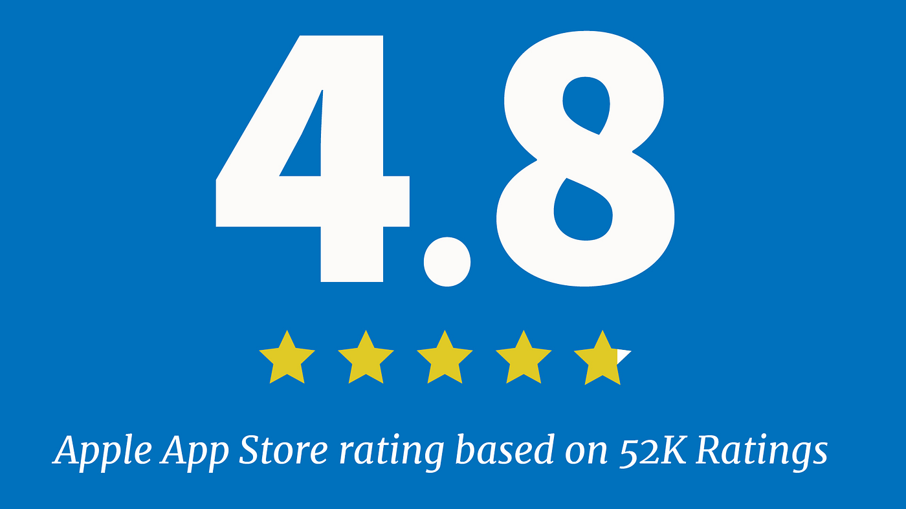
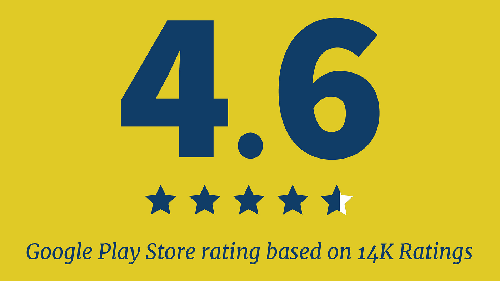

---
# Page template info (DO NOT EDIT)
layout: default
blog_page: true

# Carousel (Edit this)
carousel_title: "Meeting veterans where they are with accessible mobile tech"
carousel_summary: "This Veterans Day, we’re honoring our current and former service members by highlighting a collaboration between the Department of Veterans Affairs and the U.S. Digital Service."
# partial path to image
carousel_image: news-and-blog/2022-11-10-meeting-veterans-where-they-are-with-accessible-mobile-tech-img/carousel-veterans-card.jpg
# accessibility text for image
carousel_image_alt_text: "U.S. Air Force Senior Airman Jamar Jackson, a United States Air Force Honor Guard ceremonial guardsman, marches in the Veterans Day Parade in New York, Nov. 11, 2018"
# should show on news and blog page. ordered by date prefix in filename
carousel_show: true

# Blog detail page (Edit this)
title: "Meeting veterans where they are with accessible mobile tech"
dateline_str: "Nov 10, 2022"
readtime_str: "5"
byline_str: "U.S. Digital Service"
permalink: news-and-blog/meeting-veterans-where-they-are-with-accessible-mobile-tech-fba73d
---

_This Veterans Day, we’re honoring our current and former service members by highlighting a collaboration between the Department of Veterans Affairs (VA) and the U.S. Digital Service, which improved Veterans’ access to critical health and benefits information._

_The_ [_Veterans Health Administration_](https://www.va.gov/health/) _is America’s largest integrated health care
system, providing care at more than 1,200 facilities across the country and serving nine million Veterans annually._

<small>U.S. Air Force Senior Airman Jamar Jackson, a United States Air Force Honor Guard ceremonial guardsman, marches in the Veterans Day Parade in New York, Nov. 11, 2018. The Honor Guard performed in the parade to honor Veterans and to
inspire, recruit, and retain future Airmen. (U.S. Air Force photo by Airman 1st Class Michael S. Murphy). Original
public domain image from [Flickr](https://www.flickr.com/photos/39955793@N07/31994342348/).</small>

## An opportunity to better serve veterans

Technology that comes about to fix a problem is great, but a tech product that exists to drastically improve a critical
experience is much better. The VA’s Health and Benefits mobile app is the latter.

As one of our first agency partners, USDS has collaborated with the VA on many exciting developments over the years,
including the launch of an in-house [digital service](https://medium.com/the-u-s-digital-service/the-u-s-digital-service-at-va-turns-3-d2f0494ec31d) and an app that allows Veterans to [apply for healthcare](https://medium.com/the-u-s-digital-service/introducing-a-new-digital-application-for-healthcare-at-va-610d8bac4c78). This longstanding partnership enabled USDS and VA teams to spot some pretty interesting data: **about 50 percent of Veterans were accessing** [**VA.gov**](http://va.gov/) **from a mobile device**. Not only that, but Veterans were performing a small subset of tasks on the website much more frequently and consistently, like checking their appointments, messaging with their healthcare provider, and retrieving lists of VA payments made to them.

Working closely together, VA and USDS recognized the opportunity to better serve Veterans by intentionally making these
common actions easier. Enter the [Health and Benefits mobile app](https://news.va.gov/109175/va-mobile-app-six-essential-facts/).

Since debuting in late 2021, more than 923,000 Veterans have used the app and more than 66,000 users have left ratings
or reviews, averaging 4.8 out of 5 stars in the Apple App Store and 4.6 out of 5 stars in the Google Play Store. In the
past year, the app has also seen an increase in daily active users from 25,000 to 85,000.

## Understanding the impact of the app

The app’s success is guided by a core tenet: To intentionally meet Veterans where they are and make their lives easier
with accessible technology. Here are two examples of the pain points the app works to solve:

- **Authentication makes sign-in easier:** Teams knew that signing in to VA.gov was an issue for some Veterans,
  particularly Veterans who were aging or might have suffered brain trauma. The Health and Benefits mobile app allows
  Veterans to sign-in once and then use their face or fingerprint to sign into the app for up to 45 days, thereby
  eliminating a major pain point.
- **Mobile Claims Upload saves time and processes more quickly:** Before the launch of the Health and Benefits app,
  sending supporting documents to prove a benefits claim meant having access to either a computer and a digital
  scanner (and then scanning your evidence, transferring it to a computer, and uploading it) or having access to a
  photocopy machine and a post office to mail physical copies of your documents. With the app’s upload feature, Veterans are now able to use their smartphone cameras to take photos of their evidence and upload in minutes. Since this feature became available, **more than 8,000 documents have been uploaded, representing about 20 percent of all claims in “under development, needs evidence” status.**

<blockquote class="pullquote" markdown="1">
  As someone who frequently uses the VA website for disability claims and healthcare, this is a huge timesaver
  <footer>– Apple App Store comment</footer>
</blockquote>

## Accessible from the start

“Since this was the modernized [VA.gov](http://va.gov/)’s first foray into native apps, we wanted to set a high bar and
think about accessibility from Day One,” explained [Martha Wilkes](https://medium.com/the-u-s-digital-service/martha-wilkes-designer-accessibility-strategist-120e6e2ecc25), who is a USDS designer and accessibility strategist at VA’s Office of the Chief Technology Officer.

The team made sure to carry over accessible design principles from VA.gov to the app, like flexible font and button
sizing, integration with biometrics to log in, and plain language that people of many different levels of ability
understand. These principles were elevated when combined with the capabilities of smartphones.

“We also wanted to take full advantage of all the excellent accessibility options built into smartphones. For example, dark mode!” Wilkes continued. “Dark mode is a classic example of an accessibility feature being useful for everyone. Over 80 percent of people use their phone in dark mode, so we made sure to add a dark theme after the initial release.”

Judging by the reviews and feedback from Veterans, the efforts are much appreciated. Here are a few of the comments:

- “As someone who frequently uses the VA website for disability claims and healthcare, this is a huge time-saver.”
- “I love this idea. I’m glad there’s [going to] be an easier way to access important documentation without having to
  sign into a computer or laptop.”
- “Love the sign in options, the biometrics are a huge time saver over the two-step verification.”

On both the Apple App and Google Play stores, Veterans have continuously left helpful comments on improvements and
additional features for the app, which have been incorporated into the product’s road map. The app is updated every two
weeks with new releases.

**_Download the VA Health & Benefits app for [Apple](https://apps.apple.com/us/app/va-health-and-benefits/id1559609596) or
[Google Play](https://play.google.com/store/apps/details?id=gov.va.mobileapp&hl=en_US&gl=US&pli=1)._**
