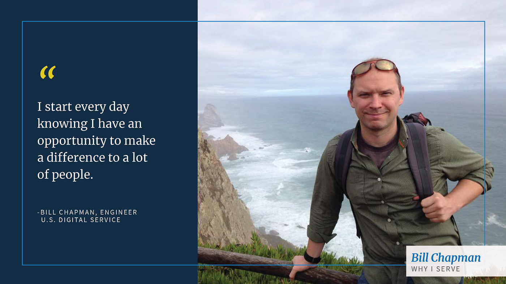

---
# Page template info (DO NOT EDIT)
layout: default
blog_page: true

# Carousel (Edit this)
carousel_title: "Why we serve: Bill Chapman"
carousel_summary: "In this series, you’ll hear stories from USDSers and learn why they decided to join, why they stay, and how their work is making an impact for Americans."
# partial path to image
carousel_image: news-and-blog/2023-04-07-why-we-serve-bill-chapman-img/carousel-why-we-serve-chapman.jpg
# accessibility text for image
carousel_image_alt_text: ""
# should show on news and blog page. ordered by date prefix in filename
carousel_show: true

# Blog detail page (Edit this)
title: "Why we serve: Bill Chapman"
dateline_str: "Apr 7, 2023"
readtime_str: "4"
byline_str: "U.S. Digital Service"
permalink: news-and-blog/why-we-serve-bill-chapman-83774e
---

_In this series, you’ll hear stories from USDSers and learn why they decided to join, why they stay, and how their work is making an impact for Americans._

## What led you to become an engineer at USDS?

Like a lot of computer geeks, my career tended to follow and grow alongside my hobbies because I was always chasing
after stuff that made me say, “Oh wow, that’s cool! How does it work?” Figuring out how it worked and then sharing it
with others is what I love to do.

Then one day I got a phone call from a client who said, “Hey Bill, your software saved someone’s life today.” I was
introduced to a new feeling. Knowing that something I built actually made a significant difference in someone’s life. At that point I knew that I wanted to move my career in a direction where those kinds of outcomes could be my focus.

When I got an email from a USDS recruiter, government work was the furthest thing from my mind, but then I thought about the ramifications of being able to help people at a scale that doesn’t really exist anywhere else and I dove in head first.

## What’s your favorite part of your job?

I start every day knowing I have an opportunity to make a difference to a lot of people. I know that the scale and speed of government means that I’m often not going to see it any time soon. But knowing that my deck is stacked in favor of helping people really makes a difference to me.

## Has anything about your position or the work surprised you?

That I fit in here so well. I spent a couple of hours walking around the Eisenhower Executive Office Building one day
pondering how surreal it is to be doing this kind of work, with this kind of team, at this place in government.

Even though life and the tech industry has been kind to me, I still identify as a blue-collar kid from the inner city of Buffalo, N.Y. Twenty years ago, I could not have imagined I’d have this opportunity today. From the day our Talent team told me about the role I knew I wanted to be here, I had no idea that I’d actually feel like I belonged.

## What’s your superpower?

I think I’m really good at finding positive outcomes in what others perceive as failures. I pride myself on believing
that many failures are just an outcome you didn’t expect. I’ve come to find that this is an asset in government work
where the size and scale of the problem takes a while to resolve and you may not be the first or the last person to try
what you are doing.

## Can you talk about a project you’re super proud of?

I’ve been assigned to projects that relate to getting benefits to individuals and families that need it the most. We are working towards goals that might not manifest themselves during my tenure, but they will matter to a lot of people when they do and I am proud to be part of that effort.

## What’s your sales pitch for USDS?

What we do here is important and mission-oriented. Whether you apply to work for USDS or another civic tech
organization, this is a worthwhile space to spend time in and I recommend considering it.

## What’s on your playlist/watch list/reading list?

I’m currently reading _Range: Why Generalists Triumph in a Specialized World_ and _Hidden Women: Data Bias in a World
Designed for Men_. They are both highly relevant to who I am and what I am doing in this role.

From my non-work-related library, I just finished Adam Savage’s _Every Tool is a Hammer_ and am re-reading Neil
Gaiman’s _The Sandman_ graphic novels before checking out the TV series.

## What books, music, film/television, or art changed you?

This is a long list but during some interactions at USDS I was just thinking about some music that had a huge impact on
me professionally.

Twenty years ago, my best friend introduced me to progressive music, like the 70’s era of [the band] Genesis with Peter
Gabriel, or some more eclectic, but still pop-friendly albums like Paul Simon’s _Graceland,_ and we would discuss
them. I was learning to play piano at the time and I realized that I had never actively listened to music before and it
was hurting my progress. Learning to actively listen to music — understanding its ebbs and flows, why they were building up tension here and or releasing it there — was a skill that took practice.

Along the way I realized that it wasn’t just music that was getting shallow attention, I wasn’t actively listening to
humans either and humans are fascinating when you actively pay attention to us.

~

**_If you’d like to work on these important projects, join us!_**

_**We’re hiring mission-driven talent professionals, engineers, designers, product managers, bureaucracy hackers,
procurement specialists, and operations pros who want to make an impact on the lives of their fellow Americans. [Apply here](/apply)**_.
