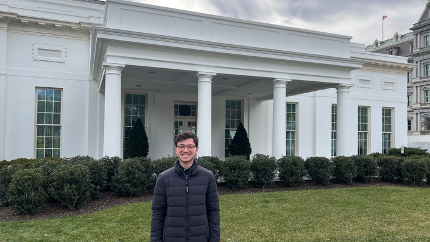

---
# Page template info (DO NOT EDIT)
layout: default
blog_page: true

# Carousel (Edit this)
carousel_title: "Why we serve: Sam Feudo"
carousel_summary: "In this series, you’ll hear stories from USDSers and learn why they decided to join, why they stay, and how their work is making an impact for Americans."
# partial path to image
carousel_image: /news-and-blog/2023-05-17-why-we-serve-sam-feudo-img/carousel-why-we-serve-feudo.jpg
# accessibility text for image
carousel_image_alt_text: "The first U.S. Digital Service intern, Sam, is standing in front of a U.S. government building."
# should show on news and blog page. ordered by date prefix in filename
carousel_show: true

# Blog detail page (Edit this)
title: "Why we serve: Sam Feudo"
dateline_str: "May 17, 2023"
readtime_str: "6"
byline_str: "U.S. Digital Service"
permalink: /news-and-blog/why-we-serve-sam-feudo-66a3b5
---

_In this series, you’ll hear stories from USDSers and learn why they decided to join, why they stay, and how their work is making an impact for Americans._

_Sam Feudo (he/him/his), the inaugural intern at U.S. Digital Service (USDS). Sam is attending The Ohio State University and graduating in May 2023. He is from Cleveland, Ohio._

_Have you ever wondered what it’s like to intern at The White House? In 2023, USDS launched our inaugural internship
program as part of the broader internship program at the Executive Office of the President. In this edition of Why We
Serve, we’re highlighting the work and experience of USDS’s very first intern, Sam Feudo._

_We asked Sam a series of questions about his tour with USDS, and in this spotlight, we’ll share his answers, including
advice for future interns, what he learned, and the projects that impacted his life and career. Let’s dive in!_

## How did you become the first intern at USDS?

It was combined serendipity and a growing passion for policy implementation and accessible design that led me to apply
for an internship at the White House. When I initially applied to the White House Office of Management and Budget (OMB)
internship program, I didn’t know USDS was an option. However, when the opportunity arose to interview at USDS, I
conducted further research on the organization’s origin and mission, which piqued my interest.

Learning how USDS was formed in response to the healthcare.gov crisis and its commitment to improving government services through technology and design deeply resonated with me. My background and interests are primarily in health policy, and USDS’s extensive project work with health agencies, including the Centers for Disease Control and Prevention (CDC) and the Centers for Medicare and Medicine Services (CMS), appealed to me. In addition, I was inspired by USDS’s dedication to making a tangible difference in people’s lives by ensuring that digital tools are accessible and effective for the public. Shortly after that, I was selected as the inaugural intern at USDS.

This experience has reaffirmed the importance of policy implementation and designing tools prioritizing end user’s needs. I am incredibly grateful for the opportunity to work with an amazing team at USDS and collaborate with people across the Executive Office of the President (EOP). This journey has broadened my understanding of policy implementation and the end user’s role in public service.

## What was your favorite part of your job?

My favorite part of the job was working with leadership daily while getting to know USDSers from diverse backgrounds and interests. I also appreciated learning about the importance of aligning policy priorities with the needs of the public and meeting them where they are. This experience gave me valuable insight into the critical role of policy
implementation in making a tangible difference in people’s lives.

## Did anything about the position or the work surprise you?

I was surprised by the unique nature and breadth of USDS and the difference our work makes on the ground. Early on, I
was given the opportunity to contribute to important projects and make meaningful contributions to the organization,
which was both challenging and rewarding.

## Can you talk about a project you’re super proud of?

One project I’m particularly proud of is my work managing and updating projects and staffing changes for USDS that span
across various federal agencies and departments and other White House offices. This task required attention to detail
and efficient management of a large amount of information, which is crucial for ensuring smooth operations within USDS.

This project helped me gain valuable experience with our project teams and contributed to the organization’s long-term
sustainability and capacity to allocate resources across various initiatives.

## What’s your sales pitch for USDS?

USDS is at the forefront of revolutionizing government services through technology and innovation. If you’re passionate
about making a real difference in people’s lives and want to work with an incredible team of experts who share the same
vision, USDS is the place to be. You’ll have the unique opportunity to work on meaningful projects and make a lasting
impact where government policy successes intersect with Americans’ everyday needs.

## What advice would you give future USDS interns?

For future USDS interns, I advise them to be open to new experiences and learning opportunities. Embrace the challenge
of working on projects that have a tangible impact on policy implementation. This internship is an incredible
opportunity to collaborate with a talented and passionate team. Please make the most of it, and don’t hesitate to ask
your colleagues for advice and insights.

## What do you plan on doing after graduation?

After graduation, I plan to pursue my interests in clinical medicine and health policy, bridging the gap between policy
and practice to improve affordability, accessibility, and quality of care. In addition, I plan to continue working with
digital tools and teams like USDS to achieve these goals while instilling greater value in care delivery.

## Did you discover a passion while working at USDS?

Working at USDS deepened my understanding of technology’s critical role in policy implementation and public service.
This experience has ignited a passion for leveraging tools like behavioral incentive design that make government
services more accessible and efficient for the people they serve. When a law is passed, the work is just beginning,
making the USDS projects both exciting and consequential.

## What books, music, film/television, or art changed you? How?

One book that profoundly impacted me is _Rush_ by Stephen Fried. It provides an in-depth look into the life of Dr.
Benjamin Rush, one of America’s founding fathers, a pioneering physician, social reformer, and educator. Dr. Rush’s
commitment to advancing medical knowledge and challenging conventional practices has encouraged me to approach my work
with a similar mindset of innovation and continuous improvement. His relentless pursuit of progress and the betterment
of society serves as a powerful reminder of the potential each of us has to make a lasting impact in our respective
fields.

_Rush_ has not only changed how I view medicine and public service but has also instilled in me a greater sense of
responsibility and optimism about the possibilities that lie ahead when we are committed to making a difference.

The agile and creative entrepreneurial vibe of USDS allowed Sam to be a future planner. As an intern, he was able to
chart a unique path forward in alignment with leadership. In a culture that constantly pushes its people to seek to
improve and challenge the status quo, Sam found meaningful ways to contribute to the long-term growth and development of USDS. Ultimately, Sam initiated projects that would impact the team long after his tour.

~

_For the first time in recent history, the EOP is offering [paid internship opportunities](https://www.whitehouse.gov/get-involved/internships/) in various offices, including OMB, where USDS sits. Dates for the Spring 2024 [OMB Internship Program](https://www.whitehouse.gov/get-involved/internships/omb-internships/) application process are forthcoming but sign up to stay connected and get updates [here](https://www.whitehouse.gov/get-involved/internships/)._
