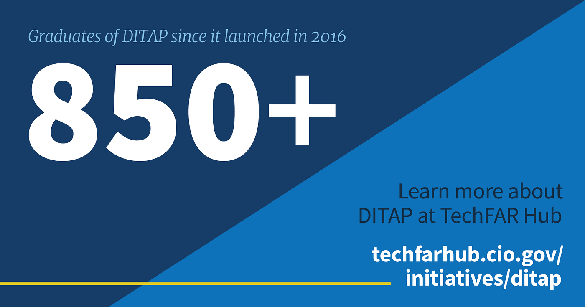

---
# Page template info (DO NOT EDIT)
layout: default
blog_page: true

# Carousel (Edit this)
carousel_title: "USDS marks nine years of transforming government services"
carousel_summary: "To celebrate our ninth anniversary, we’re highlighting nine projects that show how Government digital services can be improved by working in partnership with agencies."
# partial path to image
carousel_image: news-and-blog/2023-08-11-usds-marks-nine-years-of-transforming-government-services-img/carousel-blog-nine.png
# accessibility text for image
carousel_image_alt_text: "Graphic montage of USDS posters"
# should show on news and blog page. ordered by date prefix in filename
carousel_show: true

# Blog detail page (Edit this)
title: "USDS marks nine years of transforming government services"
dateline_str: "Aug 11, 2023"
readtime_str: "8"
byline_str: "Mina Hsiang, USDS Administrator"
permalink: news-and-blog/usds-marks-nine-years-of-transforming-government-services-37fe17
---

_To celebrate, we’re highlighting nine projects that show how Government digital services can be improved by working in
partnership with agencies._

Nine years ago, the United States Digital Service, or “USDS,” got our start as a small team based at the White House to
change how Government delivers services in a digital age. Since August 11, 2014, we’ve been laser-focused
on [our mission](/mission) to deliver better Government services to the American people through
technology and design.

We do this by partnering with Federal agencies — we’ve worked with more than 20 at this point — to create, update,
redesign, reimagine, and transform Government services for the better and to help those agencies build their ability to
continue to do so into the future.

Our teams are a mix of engineers, data scientists, product managers, designers, procurement specialists, communicators,
talent professionals, and operators, and over the past nine years, we’ve grown from a handful of folks to more than 200
professionals. Through that time, we have enabled the delivery of dozens of improved services and supported the curation and formation of digital service delivery teams to expand and continue this important work — creating long-term impact in the Federal Government.

For our **ninth birthday**, I wanted to share **nine great examples** of programs we have been working on across the
Government and in close partnership with agencies to ensure the Government delivers more simple, seamless, and secure
services. Let’s dive into the nine impactful projects we believe you’ll enjoy learning more about.

## 1. Helping the nation navigate a critical infant formula shortage

In the summer of 2022, the country experienced a historic and severe shortage of infant formula, with some media outlets reporting an out-of-stock rate of 70 percent by the end of May. This shortage affected babies and older medical patients who depend on feeding tubes for nutrition.

USDS jumped into action and partnered with the Department of Health and Human Services (HHS) to create data systems and
perform critical analysis, allowing Operation Fly Formula to effectively predict needs for what should be brought into
the country and then target formula deliveries nationwide.

We also helped the department re-launch its formula homepage, [hhs.gov/formula](https://www.hhs.gov/formula/index.html), targeting users’ needs through direct user research. That site provided an important resource with more than a half-million visits from caregivers looking for practical medical guidance on infant formula.

## 2. Launching a five-star mobile app for Veterans’ benefits

We have had a long, nine-year partnership with the Department of Veterans Affairs (VA), which has included helping them
re-launch their main website that allows Veterans to access services. Over time, we’ve seen that about half of all
Veterans visiting the VA’s website were using a mobile device.

Our support led the VA to build and launch a top-rated mobile app in late 2021 that lets Veterans do an expanding array
of important tasks such as checking benefits, booking appointments, messaging healthcare providers, and looking at lists of VA payments.

Since its launch, over one-million Veterans have used the app, and it’s garnered nearly perfect ratings in the app
store, with over 80,000 five-star reviews. _Find out more about this project [on our blog](/blog/meeting-veterans-where-they-are-with-accessible-mobile-tech)._

## 3. Reducing the burden of child care assistance applications

The $7 billion child care assistance program run by the Office of Child Care (OCC) at HHS helps almost a million
lower-income families nationwide pay for child care so parents can work, pursue an education, or attend job training.
It’s a Federal program, but states, territories, and Tribal Nations create the applications, determine eligibility, and
issue payments to child care providers.

USDS worked with the OCC team at HHS’s Administration for Children and Families (ACF) to tackle the burden on families
navigating the confusing and unnecessarily complicated application process. The complex processes also create challenges for state staff to approve the applications quickly.

The result is a guide for states, territories, and tribes called the Guide to Creating a Family-Friendly Child Care
Assistance Application, which will help reduce burdens and break down the barriers for families that need child care
assistance.

_Read more about this work [on our blog](/blog/reducing-burden-of-child-care-assistance-applications) and in [our projects](https://www.usds.gov/projects/acf)._

## 4. Helping the government smartly buy technology

Acquiring the right digital tools and capabilities is essential for Federal agencies offering services to the American
public. The process Government uses to purchase goods and services, called procurement, can make or break efforts for
the Government to meet the needs of all people.

Since 2016, we have partnered with the White House’s Office of Federal Procurement Policy to create and run an immersive development and training program for digital services procurement to help contracting professionals across the Government learn and use best practices — saving money, improving security, and improving outcomes for the public.

The program is called DITAP, which stands for the Digital Information Technology Acquisition Professional Program, and
more than 850 Federal contracting professionals have graduated from the program so far.

_Learn more about [DITAP at this link](https://techfarhub.usds.gov/get-started/ditap/)._

## 5. Helping SSA launch a more usable front door

About 180 million people visit the Social Security Administration’s website each year to accomplish critical tasks, from enrolling in retirement benefits to managing disability and survivor benefits and getting new Social Security Cards. SSA wanted to redo their site to be more intuitive, accessible and to make it easier for the public to accomplish what they need to do and brought us in to help them do just that.

Through an iterative process, including extensive user research and incorporating new interactive tools, our combined
team launched a new site in late 2022. Since then, customer satisfaction scores have increased by over 15 percent, and
task completion rates have risen 10 percent, allowing more public members to be efficiently and effectively served
online.

## 6. Agency transformation: The Digital Service at the Centers for Medicaid & Medicare Services

The Centers for Medicare & Medicaid Services (CMS) knew after their rocky 2013 launch of Healthcare.gov that they needed to build out new capabilities. That problem had been tackled by an interdisciplinary team of engineers, product
managers, and designers, who worked to restore service and improve access to healthcare benefits.

Based on that experience, CMS knew that they needed a dedicated team of technologists to tackle digital challenges,
including Healthcare.gov and beyond, and beginning in 2015, they partnered with USDS to build a joint team providing
those capabilities.

Over the years, professionals from USDS and CMS have worked side-by-side to implement and redesign critical healthcare
infrastructure, like re-launching the 9–8–8 Suicide and Crisis Lifeline, modernizing the systems that pay $1 trillion a
year in Medicare claims, implementing the Quality Payment Program, launching the No Surprises Act webpage; and promoting the importance of seamless and straightforward digital services at the agency.

_Read more about one of CMS’s
projects in [our projects](/projects/medicare-payment-program)._

## 7. Creating open-source tools to understand the impact of climate change

When the Federal Government announced the historic Justice40 Initiative, committing to invest 40 percent of the dollars
from many Federal Government programs in the disadvantaged communities that are marginalized, underserved, and
overburdened by pollution, it was clear that agencies needed tools to enable those investment choices.

USDS collaborated with the Council on Environmental Quality and the Office of Management and Budget to build the Climate and Economic Justice Screening Tool, which collects and transparently synthesizes data from 13 different sources, allowing agencies to do their analysis and determine how dollars should be allocated.

This supports ongoing work to ensure that Government can appropriately support the communities and people most
negatively impacted by the changing climate.

_Read more about this program and our work [on our blog](/blog/tackling-the-climate-crisis-with-open-source)._

## 8. Designing programs to help new parents

Spurred by an Executive Order on Customer Experience to re-orient Government services around how people experience
significant — and often challenging — life events rather than around how Federal agencies might interact with those
events, we partnered with the Office of Performance and Personnel Management in 2021 to identify and understand key
pivotal moments in people’s lives.

Unsurprisingly, carrying and delivering a child is one of the most life-changing experiences for many people. For
low-income families, interacting with a tangled web of Government websites and offices can add to the stress of this
experience.

Our 0–5 Life Experience team and our partners at HHS listened to families nationwide about their lives as parents of
babies and young children and how the Government could reduce burdens from programs and better support them. Based on
that research, we are helping HHS pilot three programs:

- The **Benefits Bundle** connects families with new babies to a collection of supportive Government services through
  personal case management.
- The **Newborn Supply Kit** provides families with basic physical supplies and health products through hospitals and
  community organizations.
- The **Federal Notification Service** helps families stay connected to Government services at crucial moments (e.g.,
  when it’s time to enroll or renew benefits) through text messages.

_Learn more about this work [on our blog](/blog/why-were-designing-government-to-work-better-and-smarter-for-families)
and [Performance.gov](https://www.performance.gov/cx/life-experiences/having-a-child-and-early-childhood-for-low-income-families/)._

## 9. Agency transformation: Helping the CDC become more pandemic-ready

The outbreak of COVID-19 showed the need for flexible, scalable public health data and technology systems that can
support a rapid response. Coordinated action requires capabilities that can provide real-time data for public health
action and emergency response at all levels of Government.

We began our multi-year partnership with the Centers for Disease Control and Prevention (CDC) in 2019 to help them
create tools and programs that connect labs and care providers to public health departments and send cleaner, faster
information to state, territorial, local, and Tribal health departments.

Our work includes creating pandemic-ready data pipelines and systems to support local public health departments and the
CDC to detect better, respond to, and prevent public health emergencies, now and in the future. Over time, we have also
supported the CDC to build their own teams and capabilities, to ensure a long-term vision and capacity for ongoing
public health data work.

_Learn more about this work on [CDC’s website](https://www.cdc.gov/surveillance/pdfs/prime_1-sheet_single-page.pdf)._

And this is just a sampling of the diverse work we engage in daily.

We know that every interaction between the Government and the public is an opportunity to deliver the value, service,
and efficiency people expect and deserve and to build trust between the public and our Government. To do this requires
expertise from both Government and industry, implementing the best equitable user experience and modern technology.

Our goal every day is to do the greatest good for the greatest number of people in the greatest need. Accomplishing that means tackling important problems today in ways that have long-term impact — partnering with agencies to help them
deliver great experiences while also building their capabilities to deliver critical services into the future.
