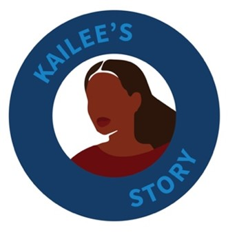
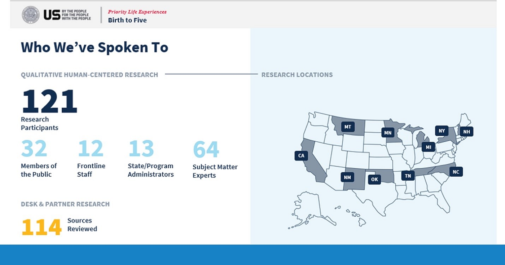
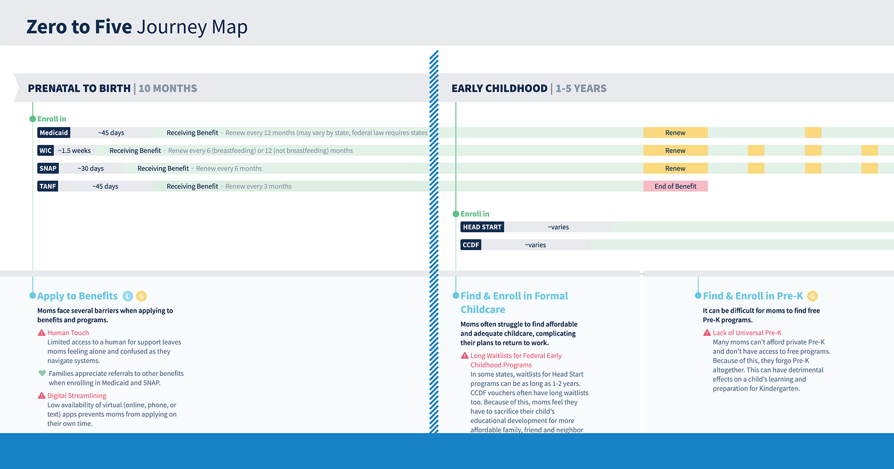
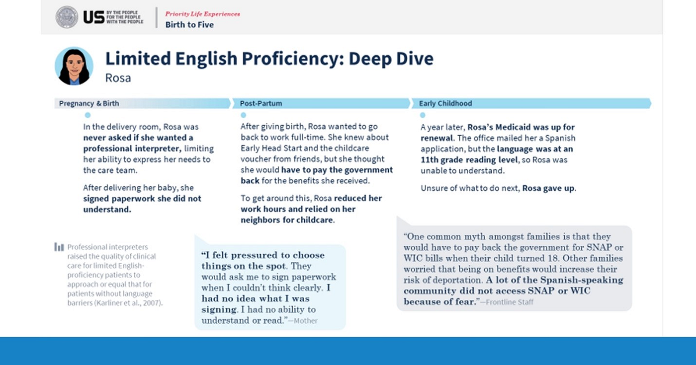
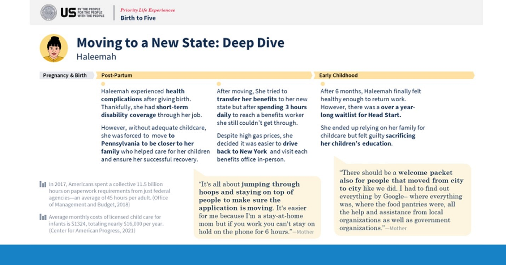
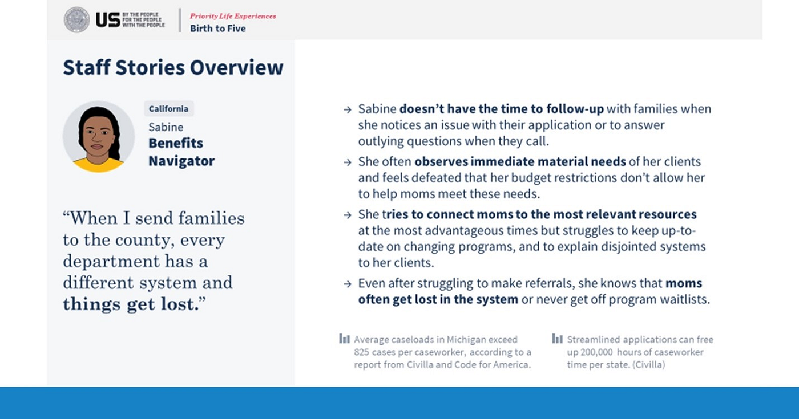

---
# Page template info (DO NOT EDIT)
layout: default
blog_page: true

# Carousel (Edit this)
carousel_title: "Solutions by Families, for Families"
carousel_summary: "How we’re working with people across the country to pilot new ways of supporting families during the critical early years — By Maya Uppaluru Mechenbier, Alana Buroff, Alex Bornkessel, Allison Abbott, and Whitney Robinson This blog is part two in a …"
# partial path to image
carousel_image: news-and-blog/2023-10-17-solutions-by-families-for-families-img/carousel-families-card.jpg
# accessibility text for image
carousel_image_alt_text: "Solutions by Families, for Families"
# should show on news and blog page. ordered by date prefix in filename
carousel_show: true

# Blog detail page (Edit this)
title: "Solutions by Families, for Families"
dateline_str: "Oct 16, 2023"
readtime_str: "13"
byline_str: "By Maya Uppaluru Mechenbier, Alana Buroff, Alex Bornkessel, Allison Abbott, and Whitney Robinson"
permalink: news-and-blog/solutions-by-families-for-families-4b8150
---

_This blog is part two in a four-part series that highlights our work on [Having a Child and Early Childhood Life Experience](https://www.performance.gov/cx/life-experiences/having-a-child-and-early-childhood-for-low-income-families/). You can read the first post, “Why We’re Designing Government to Work Better and Smarter for Families” on [our blog](/blog/why-were-designing-government-to-work-better-and-smarter-for-families)._

[Human-centered design](https://www.performance.gov/cx/hcd/) (HCD) is a problem-solving method that prioritizes
research and collaborative creativity to develop solutions for people’s needs.

In this blog, we will explore how an ongoing human-centered design research process can help to modernize and implement
services that are more simple, accessible, and equitable.

## The lived experience of a new mom

The HCD approach starts by listening to the stories of people who have gone through similar experiences and using their
insights to develop solutions.

Our team connected with hundreds of mothers and caregivers who shared their real-life experiences with our interagency
team, comprised of researchers, designers, evaluators, technical experts, and policy professionals. We created several
composite profiles from these stories that represent the challenges people face.

Kailee\* is a first-time mom. When she discovered she was pregnant, she had mixed feelings, both excited and nervous,
about embarking on this journey as a single mother who had just lost her job.

During one of her first prenatal appointments, Kailee received a stack of pamphlets about different government benefit
programs. However, she had felt ill all day, and the information overwhelmed her, so she put the information away in her bag to read when she could pay closer attention. But after leaving the doctor’s appointment she was engulfed with her other responsibilities and forgot about the benefit program pamphlets.

Several months after giving birth, Kailee received an unexpected medical bill, even though she was enrolled in Medicaid. Panicked, she reached out to her church for advice. Her pastor shared that Kailee might be eligible for federally funded programs such as:

- The Special Supplemental Nutrition Program for Women, Infants, and Children ([WIC](https://www.fns.usda.gov/wic))
- The Supplemental Nutrition Assistance Program ([SNAP](https://www.fns.usda.gov/snap/supplemental-nutrition-assistance-program))
- Temporary Assistance for Needy Families ([TANF](https://www.acf.hhs.gov/ofa/programs/temporary-assistance-needy-families-tanf))

She called each office but was frustrated with the wait times or confusing phone systems. Instead, she figured going in
person would be easier, but visiting each office required her to take several bus rides with her newborn and hours of
sitting in a waiting room.

It was a stressful situation for Kailee, and she did her best to keep her newborn comfortable during these extended
periods. This process spanned several days, and the cost of transportation cut into her grocery budget for the week.

Finally, after collecting all the required documents and providing nearly identical information in three separate
applications, she waited to find out if she’d been approved.

Weeks passed without an update, and Kailee struggled to cover the cost of baby essentials, such as diapers and a
stroller. Stretched thin, she reached out to a moms’ mutual aid group for diapers and formula to hold her over as she
waited for her benefits to kick in.

This story was typical of many mothers and caregivers who shared their experiences with us.

_\*Kailee’s name is fictional to protect her privacy._

<blockquote class="pullquote" markdown="1">
Solutions are never implemented and change never comes. There’s inquiries and roundtables, but is it really just for information-sake or is it because we’re really going to do something in the next term?
<footer>– Community Health Worker in South Carolina who supports new moms</footer>
</blockquote>

## Our approach

The prenatal period is a critical time to learn and apply for benefits. Illustrated through Kailee’s story, the access
to easily understood information about relevant benefits, reinforced by touchpoints with trusted community advocates, is fundamental to preparing expectant parents for the journey ahead. Without support before birth, families may struggle with meeting their needs and navigating benefits with the added activity and stress of having a newborn.

The unique mandate of the [Customer Experience Executive Order](https://www.whitehouse.gov/briefing-room/presidential-actions/2021/12/13/executive-order-on-transforming-federal-customer-experience-and-service-delivery-to-rebuild-trust-in-government/)
empowered our team to employ an HCD approach and develop solutions for improving the experience of families accessing
multiple government resources, beginning with insights from stories like Kailee’s.

The “Birth of a child and early childhood” designated Life Experience team had the task of identifying ways to improve
how we deliver federally funded services across agencies and programs to families with young children in America.

This area has decades of research behind it, with well-defined problems, but there are no easy solutions. We wanted to
understand better how we could connect and deliver existing programs, using the resources and tools we had.

We wanted to ensure that we were:

- Co-designing with families
- Researching the ideas and work of civic thought leaders
- Synthesizing, not duplicating, existing research

We started by building a team of people with diverse experiences conducting research in and delivering programs related
to maternal health, social determinants of health, and early childhood across agencies and levels of government.
Additionally, we brought in experts with agile skillsets to synthesize knowledge and develop feasible solutions for
long-standing issues.

## How we worked

Throughout the Discovery and Design phases of our projects, we adhered to several principles that can better enable more equitable solutions for real problems:

### Design with users, not for them

Collaboration at every level is necessary to achieve co-creation. It is essential to consider diverse viewpoints from
partners in the federal government, local government, community organizations, and individuals. To achieve fairness, we
adopted an asset-based approach and asked questions that helped us understand:

- What are the community’s strengths?
- How can we build from them?

#### _In practice_

We created a safe, non-judgmental environment for vulnerable families to share their experiences. We collaborated with
trusted community partners to identify families and conducted interviews at a comfortable location. We included Spanish
speakers when possible and ensured families understood how their information would be used. Families were given the
option to end the interview if they felt uncomfortable.

During our initial discovery phase, we conducted over 120 interviews within a few months. As we progressed into the
design phase, we conducted site visits across the country, which further increased the number of interviews. We
interviewed families, community workers who serve them, and program employees of federal, state, local, and tribal
governments.

We spoke with families from diverse backgrounds, including recent immigrants, non-native English speakers, and Tribal
members, with varying geographic locations, income levels, and rural/urban spectrums.

Many communities in this country have creatively designed supports and provided vital services to new parents, despite
limited resources and administrative and logistical barriers. We drew inspiration from these on-the-ground civic leaders and solutions to learn how our federal team could elevate and scale solutions that had proven outcomes driven by the power of innovative and courageous communities, rather than assume we knew what could work for them.

In our process, we created concept sketches based on their stories and insights. Visiting pilot sites early and often in our approach allowed us to have families and community leaders shape, validate, or change the design direction.
Together, we built a path to a set of interventions that will be valuable to families.

### Provide incentives to research participants for their time and effort

Federal agencies recognize the importance of including hard-to-reach populations — particularly those from underserved
communities — in customer research to improve quality and representation.

With those insights, we obtained budget and legal approval to incentivize our user research participants for their time
and effort. Given that we wanted to include underserved communities, providing incentives was essential for ensuring
that the feedback we received was from an unbiased sample. For instance, many of our more vulnerable participants are
juggling multiple jobs, caretaking duties, or complex illnesses while trying to renew their benefits; the sessions may
be frustrating and stressful for the participants, or they may have had a poor experience with government services in
the past and would not otherwise participate.

#### _In practice_

We gave our research participants flexible gift cards in a fixed amount as an incentive for their time and effort.

### Design for the user with the most challenging path today, inherently improving the usability for all

When designing with equity and inclusivity in mind, it’s critical to design for the most complex use case, as this
ultimately can make the service more simple, seamless, and accessible for all.

#### _In practice_

Our participant population was intentionally selected to include a higher proportion of families that often face more
obstacles when raising a child during the early years. This included families with limited English proficiency,
single-parent households, immigrant families, families of color, including Black and Indigenous families, and families
with a caregiver experiencing substance use disorders.

Starting with lived experiences can improve solutions by accounting for stigma, language accessibility, technology, and
distrust of government. Solutions provided in advance can be helpful to those who do not encounter the same obstacles.
Even if someone has multiple college degrees, they may not have the time to decipher complex instructions. In such
cases, they would much rather read a plain language version when filling out a form.

## Discovery phase findings

After conducting our HCD research, we put together a journey map that represents a significant portion of the
experiences we learned about from families from their point of view. The map covers the period from when a family
discovers they are expecting a new child to when the child begins kindergarten. The map includes interactions with
medical providers, their community, and various benefit programs they use along the way.

We combined familiar stories that paint the picture of a family’s lived experience. In addition to Kailee’s story at the beginning of this blog, we also mapped out recurring themes for those navigating the zero to five years with limited English proficiency.

We also mapped a story for those who move to a new state and must navigate transitioning their supports.

We knew any solution we designed must also work for the professionals on the front lines, serving families (for example, those who work in WIC offices or community health workers). To account for this perspective, we also developed a persona that reflects the common themes we gathered from our conversations with community workers.

In compiling these stories, mapping journeys, and synthesizing interviews, the team identified hundreds of pain points
families face during their child’s zero to five years. We focused in on what our team could feasibly address through
interagency collaboration and executive action. Which problems could we solve with the resources we have available to
us, given the need for legal and technical feasibility? How could we meaningfully move the needle in a reasonable
timeframe?

### Four pain points rose to the top.

**1. Families aren’t getting the right information at the right time.**

_“I didn’t find out about housing support till my daughter was three; only found it because I physically went looking for the housing benefits office. And then it took one year to get the benefit.”_

On one end of the spectrum, many new parents are unaware of the available programs. On the other hand, other parents mayreceive a one-time flood of resources that is difficult to digest, such as in the hours following giving birth.

**2. Families face administrative barriers applying to programs.**

_“When you call to try to talk to somebody, you never can get through. […] If I leave her a message, it’s probably that I have to leave her six messages before she’ll ever call me back. And it’s two or three weeks before they will call me back.”_

The application processes for expecting and new parents can be time-consuming and resource-intensive, with siloed
procedures adding to the burden. Additionally, limited virtual options and inconvenient office hours prevent parents
from being able to apply at a time that works for their work or transportation schedules.

**3. Families lack key physical goods — like diapers and breast pumps — after giving birth.**

_“The baby came 2 weeks early. We hadn’t gotten a car seat yet because we were saving up for it. But babies don’t care if you don’t get paid till Friday.”_

The cost of critical family supplies, such as diapers and breast pumps, fall outside most benefits program coverage, and reimbursement can be slow and cumbersome for items that Medicaid covers.

**4. Families face barriers to maintain benefits as they juggle the responsibilities of parenthood.**

_“My last SNAP re-enrollment letter got lost in the mail, and we ended up going 3 weeks without food stamps while the paperwork got in order.”_

Benefits program communications about re-enrollment requirements and timelines can be confusing, especially as they
often rely heavily on mail-based communications methods.

## What’s next?

As we implement the design phase, we’ll continue to use a human-centered design approach that drives how we design,
launch, and deliver public services.

Based on the insights we’ve gained from innovative community leaders and families, we are confident our team, working
with communities and our pilot partners, can improve the way the federal government serves families in the early years.

Learn more about our pilot solutions and projects, and how we’re testing them through continued co-design with families
at the [Having a child and early childhood](https://www.performance.gov/cx/life-experiences/having-a-child-and-early-childhood-for-low-income-families/) life customer experience page.

~

_This blog is part two in a four-part series that highlights the “Birth and early childhood” Life Experience team’s
work. Brought together by the Customer Experience Executive Order, teams are tackling the extraordinary challenge of
modernizing and implementing government services that are simple, accessible, easy to use, and equitable for families._

_Read the team’s first post, “Why We’re Designing Government to Work Better and Smarter for Families” on [our blog](/blog/why-were-designing-government-to-work-better-and-smarter-for-families)._
