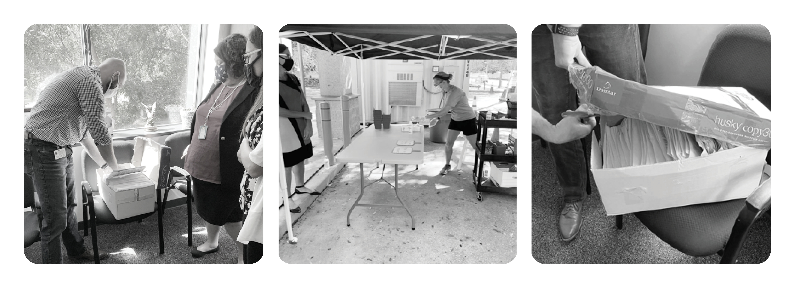
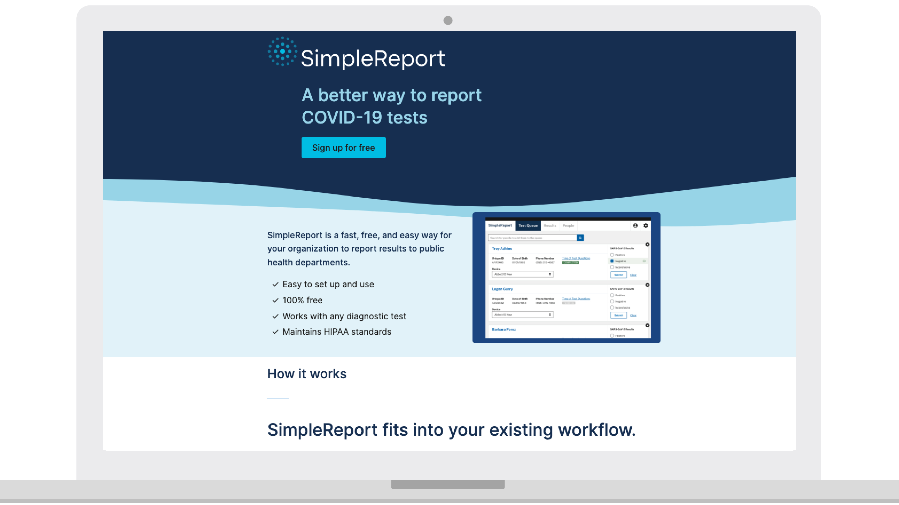
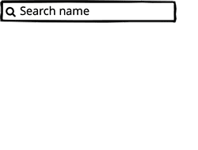
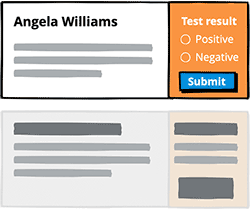
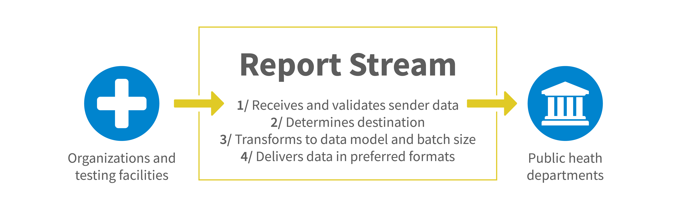
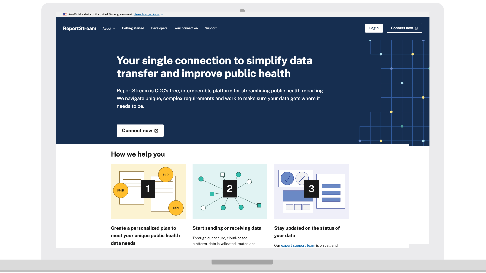

---
# Page template info (DO NOT EDIT)
layout: default
banner_file: banner--people-projects-lg.svg
banner_file_mobile: banner--people-projects-sm.svg
project_page: true

# Carousel (Edit this)
carousel_title: "Preparing for the next pandemic while building tech for COVID-19"
carousel_summary: "We worked with the Centers for Disease Control and Prevention to quickly create and scale technology programs that digitize and share infectious disease test results in real-time."
carousel_image_name: project-cdc-simple-report-card.jpg
# accessibility text for image
carousel_image_alt_text: "Project photo"
# should show on home page. ordered by date prefix in filename
carousel_show: true

# Project detail page (Edit this)
title: "Preparing for the Next Pandemic While Building Tech for COVID-19"
agency: Centers for Disease Control and Prevention
permalink: projects/cdc-simple-report
project_url: https://www.simplereport.gov/

# Impact statement (Edit this)
impact_statement:
  - figure: "40"
    unit: "M+"
    description: |-
      COVID19 Test Results Sent to Public Health Departments
      
  - figure: "852"
    unit: "K+"
    description: |-
      Working Hours Saved

  - figure: "15"
    unit: "K+"
    description: |-
      Facilities Connected to Simple Report and/or Report Stream

  - figure: "45"
    unit: "+"
    description: |-
      Local, State, Tribal, and Territorial Public Health Departments Using Simple Report and/or Report Stream
  
  - figure: "6"
    unit: "&nbsp; weeks"
    description: |-
      from start of project to first Simple Report test result delivered
---

## Background

When the United States became the deadly epicenter[^1] of the global COVID-19 pandemic in 2020, surpassing one million cases and close to 60,000 virus-related deaths[^2] by the end of April, crucial gaps in our nation’s capacity to collect, analyze, and, importantly, share public health data with people became clear. The Centers for Disease Control and Prevention (CDC), our nation’s leading science-based, data-driven service organization that protects the public’s health, brought in the U.S. Digital Service (USDS) to help quickly create and scale technology programs that could digitize and share infectious disease test results in real-time. 

Both the USDS team and CDC leaders recognized that the nation urgently needed these technology programs for the current crisis, as well as to respond to future disease outbreaks, so USDS agreed to build these vital tools. This initial, quick-turnaround project ultimately led to a years-long partnership to help the CDC reorganize as a data-first agency with high tech at its core. 

## The Challenge

In the months following the first confirmed case of COVID-19 in the United States, the entire nation had become one giant testing site. Makeshift drive-up and walk-in testing stations popped up in strip mall parking lots and on street corners, contributing to the mass of test results flying around the country alongside test results from more established healthcare institutions like pharmacies and hospitals. 

These testing sites were instructed to report their findings back to their local (or state, territorial, or Tribal) public health department, which resulted in piles of paper forms, previously stored in boxes, being faxed from facilities to health officials. From there, public health department workers had to manually type in these paper results into computer systems — that were often particular and aging systems — to send to CDC. This led to these local, state, territorial, and Tribal departments calling in reinforcements to deal with the influx of paper: some hired contractors, some called in the National Guard to type in lab results. 

*Photos from field research.*

Before COVID-19, processing test results in this way didn’t present enough burden or delay to prompt an overhaul. However, the swift spread of COVID-19 and the magnitude of tests required to track the disease overwhelmed the old system, which was extremely manual and laborious for places that offered, or required, COVID-19 tests. The old system was also slow, error-prone, and held back the public’s understanding of and response to the disease, partially because test results would often be sent to the wrong public health department. 

Fast, accurate, and centrally located test data is crucial to stopping the spread of infectious diseases because it enables governments to identify outbreaks and minimize further spread.  It also just makes sense, in a world where most COVID-19 tests are performed in highly computer-automated labs, and attached to electronic health records, along with other digital healthcare infrastructure.  

The USDS team working in the field identified the need for at least two novel software tools to handle this acute moment: Simple Report, which allows anyone testing for COVID-19, from a school nurse to a volunteer at a free testing site, to easily collect test results and report them; and Report Stream, which standardizes and routes test results from testing sites to public health departments. 

Neither of these functions existed in forms that states could easily use or that the agency could easily add to existing CDC tools. Working with CDC, the USDS team decided to try something new.

## The Solution
**A People-Centric Approach: Learning from Users**

We had to understand the needs of workers and volunteers on the frontlines of COVID-19 testing before we could build tools that they would actually want to use. The USDS team used human-centered design principles[^3]  and methods of design research to understand the obstacles users, like school nurses, faced when capturing and submitting COVID-19 testing data.

The team interviewed more than 100 people — including people from more than 20 local and state public health departments — in eight different states over the course of five months to “**design with users, not for them**.” We embedded with users as they collected COVID-19 tests and uploaded the test results to the tools we were building and re-building. We did this so we could design a tool that addressed common challenges for the end users, like the ability to enter new results into existing patient profiles, or open several patient profiles at the same time. By embedding with COVID-19 workers, we also helped to prevent or correct common data entry errors.

Using a methodology adapted from successful technology startups, we started lean with a “build only what’s necessary” philosophy. We recruited our users for these tools while creating the tools so we’d be able to get feedback and make updates immediately after launch. We worked quickly, using the incremental and iterative approach of agile development. We were able to continuously test the functionality, security, and ease-of-use of the tools and make improvements accordingly. 
Saving time when onboarding new personnel with an intuitive interface meant that people didn't have to spend several hours in training to learn a new tool.

<blockquote class="pullquote" markdown="1">
Simple Report cut my reporting time in half from one hour to 30 minutes.
 <footer>– Community Director and Registered Nurse in Illinois</footer>
</blockquote>

**Empowering Users to Easily Track and Report Test Data**

The virality of COVID-19 meant that many people were testing for the disease and recording the resulting data, even if they weren’t trained healthcare professionals. 

Through constant testing with actual users and quick updates, the USDS team worked with government contractors to build **Simple Report**, a free, easy-to-use, browser-based program for testing locations to collect and store results. Simultaneously, we addressed the other end of the test results pipeline and created a second program, **Report Stream**, that reformats and routes those test results (and test results from other software programs) to the correct public health department. <a href="#reportstream"> *(Skip to learn more about Report Stream.)* </a>

  &nbsp;&nbsp;&nbsp;&nbsp;&nbsp;&nbsp;&nbsp;&nbsp;&nbsp;&nbsp;&nbsp;&nbsp;&nbsp;   

<blockquote class="pullquote" markdown="1">
Simple Report has been a key tool to progress Alaska as a state toward efficient COVID test result reporting[…] It filled critical gaps in remote, rural areas, in schools, and in the fishing and tourism industries Alaska’s economy relies on.
 <footer>– Anne Zink, MD, Chief Medical Officer, State of Alaska</footer>
</blockquote>

Simple Report makes it easy for test sites to upload both of the most common types of COVID-19 test results: PCR and Antigen. It’s flexible enough to work for many types of places that need to test people often, including schools, cruise ships, and nursing homes. Simple Report is also, most importantly, really simple. Most people can learn how to use it in less than 15 minutes.

<a name="reportstream"> **Helping Users at Test Sites Share Crucial Public Health Data** </a>

Quickly collecting test results was one part of the solution, but our team knew the test results needed to be sent to the right public health department – and they needed to be in the correct format for that department to quickly process and analyze the data. This is where Report Stream came in. 

Acting as a sort of traffic cop for public health data (like COVID-19 test results), Report Stream ingests many different types of forms from various senders — not just results from Simple Report — then decides where they should go, and converts the data to the right format for that particular destination. 

These functions solve two additional problems for workers and volunteers at testing sites: deciding which jurisdiction should get the test results and making sure the data is formatted correctly for that jurisdiction. 

Not knowing the answers to either of these questions or spending precious manual hours reformatting results took time that care providers could have spent fighting COVID-19; created bottlenecks of information about the spread of the virus; and ultimately compromised the health of the country in those first, crucial months of the pandemic.

<blockquote class="pullquote" markdown="1">
Without [Report Stream] we wouldn’t have received those reports at all, or we would have had numerous pages of faxes. This initiative really improved our interoperability.
 <footer>– Monica Gamez, Deputy Associate Commissioner, Texas Department of State Health Services</footer>
</blockquote>

## The Impact
**Saving Time and Preparing for Future Emergencies**

Simple Report and Report Stream saved healthcare workers **more than 852,000 hours of manual labor** during the height of the COVID-19 pandemic – when every minute mattered. 

This work helped the CDC develop an understanding of how to build technology for local public health departments. It also set expectations across the CDC that data should be available quickly and that software tools could be built iteratively, deployed quickly, and should be easy-to-use. Another important takeaway was that the usability of a tool can drive adoption in circumstances where the CDC had previously struggled to collaborate with local public health departments. 

The technology that USDS teams co-created for responding to the COVID-19 pandemic was also repurposed for an unexpected Mpox outbreak in 2022 and is helping the CDC better understand seasonal flu outbreaks. Born in response to the COVID-19 pandemic, these technology programs are built to thrive and evolve within the complex public health environment.

<blockquote class="pullquote" markdown="1">
Thanks to a joint discovery sprint with USDS, we uncovered ways to 
fix how diseases are reported and we developed recommendations that are being implemented.
 <footer>– Dr. Jennifer Layden, PhD, Director, Office of Public Health Data, Surveillance, and Technology at the Centers for Disease Control and Prevention</footer>
</blockquote>

**The Foundation for Ongoing Pandemic Needs**

At the start of our partnership with CDC, we advocated for a data strategy that went beyond test results. USDS teams worked with the agency to set an expectation that we’d need to collect real-time data on hospitalizations, bed availability, new COVID-19 cases, and vaccine availability. This strategy also directly tied to a later project, launching Vaccines.gov and Vacunas.gov to help people find COVID-19 vaccinations. (Read more about [that project here.](https://www.usds.gov/projects/vaccines-dot-gov))

**A Data-Driven CDC**

USDS is helping the Office of Public Health Data Surveillance & Technology, in conjunction with other CDC leaders, build new technology capabilities for a data-driven CDC. This includes championing practices that [we’ve vetted with other agency partners](https://playbook.cio.gov/), like: 

* building technology **iteratively** to allow for quick updates as conditions change

* investing in deep **field research** to understand the needs of the people who will use the software

* using **human-centered design** principles to make sure those needs are at the center of the products we build

* **removing data and technology silos** to cross analyze and efficiently use data from all available sources to drive critical policy and emergency decisions 

* promoting **interoperability** and **use of standards** so systems can connect safely, reliably, and quickly 

* helping to **[hire experienced technologists](https://www.usds.gov/projects/smeqa)**, data scientists, product managers, and designers

[^1]: https://www.ncbi.nlm.nih.gov/pmc/articles/PMC8136644/
[^2]: https://www.cdc.gov/museum/timeline/covid19.html#Early-2020 “April 4, 2020: More than 1 million cases of COVID-19 had been confirmed worldwide, a more than ten-fold increase in less than a month.”
[^3]: According to Digital.gov, human-centered design is a qualitative research method that helps groups solve problems and seek solutions that prioritize customer needs over a system’s needs. It’s also a design and management framework to develop solutions to problems by involving the human perspective in all steps of the problem-solving process.

