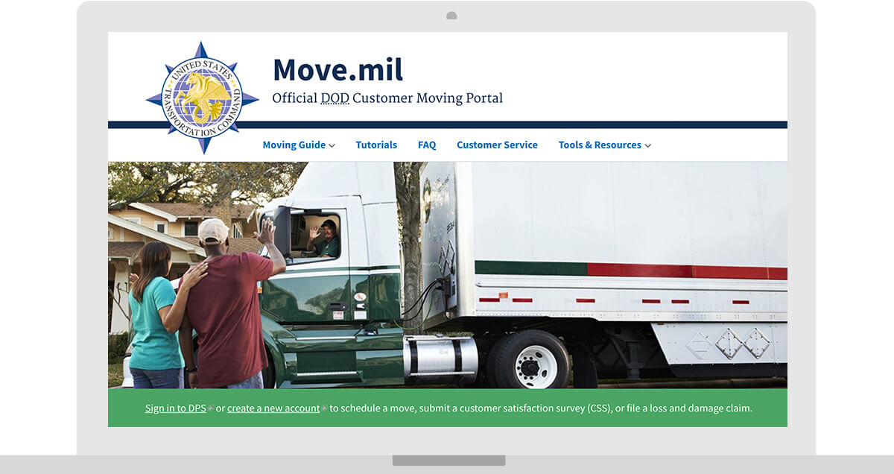
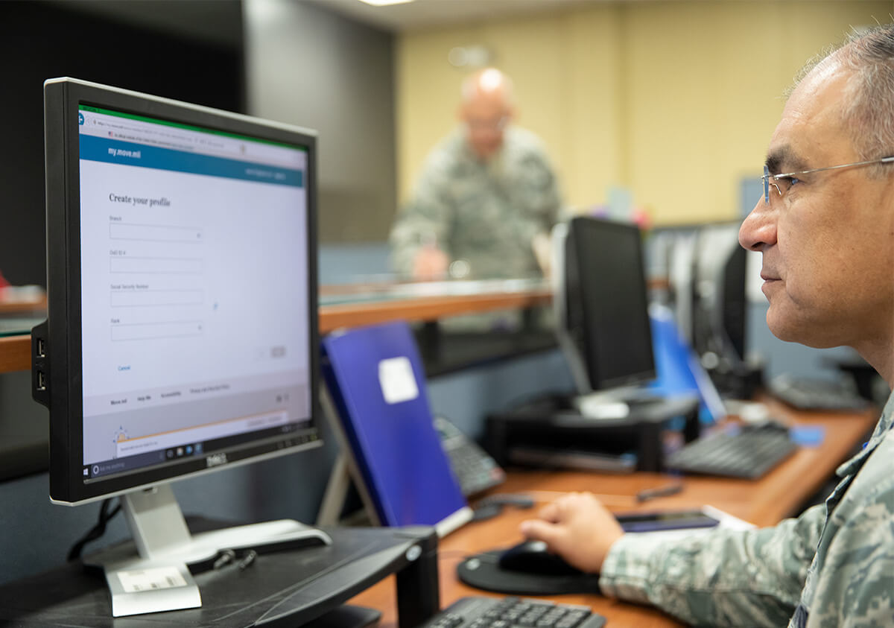

---
# Page template info (DO NOT EDIT)
layout: default
banner_file: banner--people-projects-lg.svg
banner_file_mobile: banner--people-projects-sm.svg
project_page: true

# Carousel (Edit this)
carousel_title: "Helping Military Families Move"
carousel_summary: "Built in collaboration with military familes, Move.mil is the first stop for service members, their families and Department of Defense civilians to plan their next permanent change of station, retirement, or separation move."
carousel_image_name: project-dod-mil-moving-card.jpg

# Project detail page (Edit this)
title: "Helping Military Families Move"
agency: Defense Department (DoD)
permalink: projects/helping-military-families-move
project_url: https://move.mil
---

## The Challenge

This is where the content goes.

      

## The Solution

## User Impact Story

      
