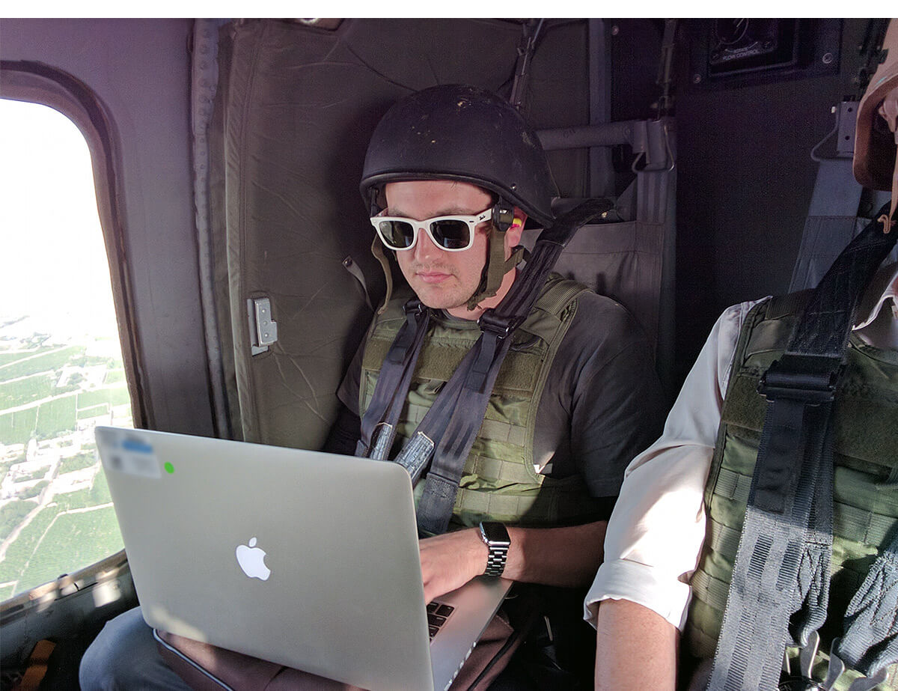

---
# Page template info (DO NOT EDIT)
layout: default
banner_file: banner--people-projects-lg.svg
banner_file_mobile: banner--people-projects-sm.svg
project_page: true

# Carousel (Edit this)
carousel_title: "Providing NATO advisors mission-critical information"
carousel_summary: "Our defense team spent 18 weeks building a critical software system with small teams on rotation to Afghanistan, working directly with NATO advisors and leadership."
carousel_image_name: project-dod-advisor-network-card.jpg
# hides on project listing page (poorly named)
hide: true
# accessibility text for image
carousel_image_alt_text: "Project photo"
# should show on home page. ordered by date prefix in filename
carousel_show: false

# Project detail page (Edit this)
title: "Providing NATO advisors mission-critical information"
agency: Department of Defense
permalink: projects/advisor-network
project_url:

# The Impact (Edit this)

---

## The Challenge

Each year, several hundred NATO military and civilian advisors are deployed to Afghanistan as part of Operation Resolute Support’s mission to train, advise, and assist the Afghan government. This mission relies on a software system called ANET to track and understand advisor engagements with their Afghan government counterparts, as well as facilitate strategic decision making for future mission development. However, the existing system suffered significant gaps in connectivity, decreased usage, poor performance, and flawed software development practices. Ultimately, the software did not help advisors pass along critical information to their successors in theatre, and failed to enable strategic decision making by leadership.

*Members of the Defense Digital Service team in Afghanistan, during the time they worked on ANET.*

## The Solution

In November 2016, the Defense Digital Service team began to replace the existing systems using modern software development standards. DDS spent a total of 18 weeks building ANET 2.0 with small teams on rotation to Afghanistan, working directly with NATO advisors and leadership. ANET 2.0 was fully deployed on a classified network to roughly 800 advisors across Afghanistan in March 2017 and long-term maintenance was handed to NATO developers based in Europe. The new system has a higher performance and faster speed, increased usability for multinational advisors, and ehanced search/ analytics capabilities.

ANET 2.0 was released on [code.mil](https://www.code.mil/), DoD’s open source program launched by DDS in February 2017. In addition, DDS is working on the broader adoption of ANET to support various security cooperation missions around the globe.

<blockquote class="pullquote" markdown="1">
The Defense Department must move at the speed of relevancy. The Defense Digital Service team plays a critical role in meeting that commitment.
 <footer>– Former Defense Secretary James Mattis</footer>
</blockquote>

*Nick Small, former USDS engineer, on a blackhawk in Afghanistan with members of the Defense Digital Service.*

## Press

[Wired](https://www.wired.com/2017/05/meet-nerds-coding-way-afghanistan-war/)
