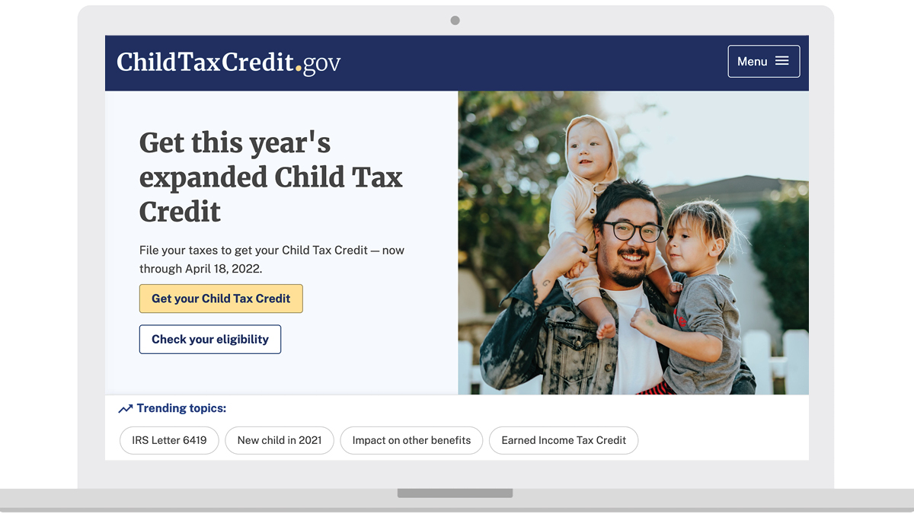

---
# Page template info (DO NOT EDIT)
layout: default
banner_file: banner--people-projects-lg.svg
banner_file_mobile: banner--people-projects-sm.svg
project_page: true

# Carousel (Edit this)
carousel_title: "Title here"
carousel_summary: "to come"
carousel_image_name: project-childcare-tax-credit-card.jpg

# Project detail page (Edit this)
title: "Childcare Tax Credit"
agency: Cross-agency or solo agency?
permalink: projects/childcare-tax-credit
project_url: https://www.childtaxcredit.gov/

# Impact statement (Edit this)
impact_statement:
  - figure: "25"
    unit: "%"
    description: |-
      Reduction in food insecurity among low-income families who received the Child Tax Credit
      
  - figure: 41
    unit: "K+"
    description: |-
      People used ChildTaxCredit.gov to find free tax filing services and receive expanded tax benefits
---

## The Challenge

The American Rescue Plan, signed by President Biden in March 2021, created unprecedented tax relief for millions of families through expanded tax credits, both for families who file for taxes and also for those who typically don’t file. As the global COVID-19 pandemic upended finances for many struggling parents, this expansion made many more families eligible for additional credits while also sending monthly, advance payments for the first time. 

But families who didn’t earn enough income to require a tax filing – the people who needed the credits the most were largely unaware of the economic assistance and how they could get it by filing a simplified tax return. 

## The Solution

The Department of Treasury and the White House asked the U.S. Digital Service to help build tools, which eventually turned into the website ChildTaxCredit.gov, to educate families about the expanded Earned Income Credit and Child Tax Credit while encouraging eligible families to file a tax return. 

Working alongside our agency partners, the USDS team interviewed local governments, advocacy groups, non-profits, and tax filers to understand how these credits affected people’s lives. We learned that misinformation and confusion kept some families from taking the steps to receive the tax credits. The website was built to address the many needs we heard from user research, chiefly that the site should be accessible, easy-to-read, and provide resources to find free tax services. 

## The Impact

The 2021 Child Tax Credit helps all families succeed and will reach nearly 40 million families representing 65 million children. The U.S. Treasury estimates the families of 26 million children will now receive the full, expanded amount of this credit. Under previous rules, they would only receive a partial credit because their incomes were too low. 

These expanded benefits reduced food insufficiency among low-income families by 25% and helped bring child poverty to record lows in 2021, including record low Black and Hispanic child poverty.

## Press

- [Harris, Yellen urge Americans to file taxes to collect remaining tax credits](https://www.reuters.com/world/us/harris-yellen-urge-americans-file-taxes-collect-remaining-tax-credits-2022-02-08/)
- [VP Harris leads Biden administration's 'Day of Action' to ensure families receive child tax credit](https://www.usds.gov/)
- [To Bridge The Digital Divide, Biden Administration Launches Vaccine Hotline](https://www.npr.org/2021/05/09/994885742/to-bridge-the-digital-divide-biden-administration-launches-vaccine-hotline)
