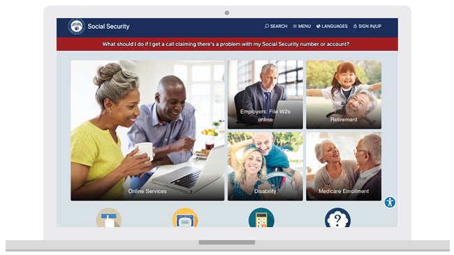
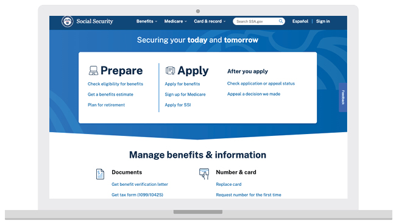
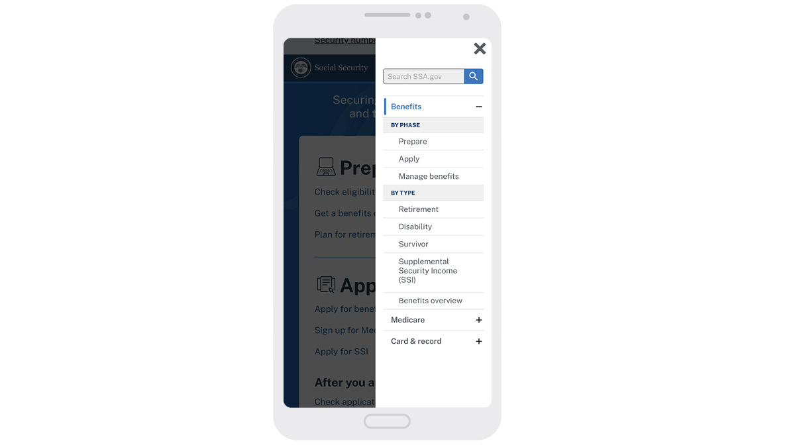
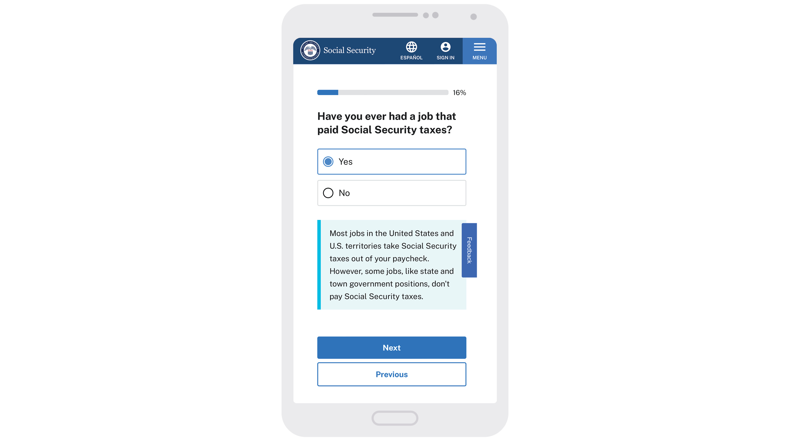
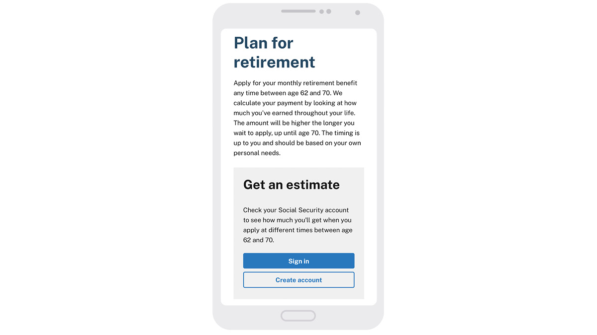

---
# Page template info (DO NOT EDIT)
layout: default
banner_file: banner--people-projects-lg.svg
banner_file_mobile: banner--people-projects-sm.svg
project_page: true

# Carousel (Edit this)
carousel_title: "Continuously Improving SSA.gov"
carousel_summary: "The Social Security Administration is building on the momentum from their partnership with the U.S. Digital Service by implementing iterative research, best practices, and a data-informed approach to ensure the website is usable and useful."
carousel_image_name: project-ssa-card.jpg

# Project detail page (Edit this)
title: "Making it easier to navigate services from the Social Security Administration by continuously improving SSA.gov"
agency: Social Security Administration
permalink: projects/ssa
project_url: https://www.ssa.gov/

# Impact statement (Edit this)
impact_statement:
  - figure: "1"
    unit: "M"
    description: |-
      more account sign-ins per week
      
  - figure: "$285"
    unit: "M"
    description: |-
      in projected estimated savings over five years in front-end processing and infrastructure expenses

  - figure: "75"
    unit: "%"
    description: |-
      of customers start an online application after learning they may be eligible for benefits

  - figure: "46.8"
    unit: "%"
    description: |-
      increase in the Customer Satisfaction Score (CSAT) since the website launch

---
<base target="_blank">

## Overview

The [Social Security Administration](https://www.ssa.gov/) (SSA) website has roughly 180 million visitors every year. It's essential for accessing and managing benefits such as Retirement and Disability, and maintaining personal records, including your Social Security number. The agency serves as a vital resource that almost every American turns to during significant moments of their life.

SSA recognized the importance of modernizing its website to meet the expectations of the public's evolving needs. We partnered with SSA to demonstrate new possibilities and kickstart digital transformation by establishing a foundation that enables iterative design and development practices.

Our partners on the SSA Web Strategy team launched the new version of the website in December 2022 and continue to build on this milestone.

## The Challenge

Initial user research showed that the public had difficulty using the website to obtain guidance and complete certain tasks during crucial moments of need. The website's lack of clear, understandable information led to some frustration.

## The Solution

Iterative research with the public, design, and modern development practices, combined with daily collaboration with subject matter experts, resulted in a foundation that demonstrates SSA's commitment to serving the American people. 

Our partnership with SSA created momentum through several building blocks.

### A task-focused information architecture

Effective navigation is crucial in improving website usability and helps customers quickly find what they are looking for. Before the redesign of ssa.gov, site visitors relied on a single, static page with 72 different links to navigate the content. As a result, customers got frustrated and lost trying to find information and complete tasks.

<!-- 

*The website before the redesign (top) and the newly redesigned version of the website (bottom)* -->

The new version of the website is far simpler to navigate. It follows standard information architecture practices and uses a primary navigation system that aligns with the tasks customers need to complete, like applying for benefits and replacing a Social Security card.

The primary navigation, header, and footer use plain language and hierarchy to provide clear guidance and prioritize the public’s needs.

<!-- 
*The Benefits menu on the website expanded on a mobile screen* -->

### A simple way to understand eligibility

To determine benefit eligibility before the redesign, customers had to read many pages of policy-focused information across several sections of the website and then figure out if it applied to their personal situation.  

To meet people where they are, SSA launched a [simple, conversational flow](https://www.ssa.gov/prepare/check-eligibility-for-benefits), that asks a few questions to help customers determine if they may be eligible for benefits. If they are, the experience offers guidance on how to prepare for the application process, which is often daunting and unclear.

This new experience uses conditional content and a dynamic interface to help the public understand complex eligibility criteria without asking them to read pages of complex, policy-focused information.  

<!-- 
*Questionnaire that helps customers determine their eligibility for benefits* -->

### Clear, organized content

Before, much of the content on the website was not written for the public, lacked clear instructions on how and where to complete tasks, and was missing the human tone that’s needed during difficult life changes. 

Tireless efforts to explain complex policies and processes led to a new approach prioritizing simple, conversation communications that meet people where they are. Examples of these efforts include primary tasks like:

* [Plan for retirement](https://www.ssa.gov/prepare/plan-retirement),
* [Change name with Social Security](https://www.ssa.gov/personal-record/change-name), and
* [When to sign up for Medicare](https://www.ssa.gov/medicare/plan/when-to-sign-up).

Plain language and clear hierarchy throughout the site increase people's confidence while navigating tasks and making crucial decisions.

<!-- 
*Plan for retirement webpage* -->

### A consistent design system

Before, the site didn’t use a design system and wasn’t optimized for mobile use. As a result, the design and development process was difficult and time-consuming, requiring manual updates on every page. Additionally, customers who accessed the site on their phones faced challenges.

Implementation of the [U.S. Web Design System](https://designsystem.digital.gov/) the design standards for federal government websites, establishes consistency, helps customers find what they need, increases efficiency for maintenance, and modernizes the experience. 

### Modern development infrastructure

Before, all updates to the site required manual development support. SSA collaborated with a third-party development contractor to establish and customize SSA's first content management system, which makes the site easier to maintain, enables quick deployment of content and features, and facilitates iterative development.

SSA integrated a Content Delivery Network (CDN) to enhance site performance, which means a fast, reliable experience for customers. The integration also enables an iterative process that allows customers to utilize the newly designed content as soon it’s ready instead of waiting for every section to be redesigned all at once.  

## The Impact

In April 2022, [SSA launched beta.ssa.gov](https://blog.ssa.gov/building-a-better-ssa-gov/), a preview of the newly redesigned site that was forthcoming in December. Initial feedback showed that the public felt empowered by the more intuitive site.

Later, in December 2022, SSA launched the new version of ssa.gov, with an initial set of pages and features that serves as the foundation as SSA continues to redesign and launch new sections.

<blockquote class="pullquote" markdown="1">
We have millions of people visiting the site, some during challenging times in their lives, so there is a deep sense of responsibility to improve their experience.
 <footer>– Suran De Silva, Director, Web Strategy at SSA
</footer>
</blockquote>

A particularly important contribution to our partnership with SSA—and the one we're most proud of—was advocating for a cross-disciplinary team of designers, content strategists, product managers, and engineers to continue SSA's digital transformation.

SSA's new Web Strategy team is using what we built together to:
* Establish sustainable standards and processes for iterative design and research.
* Demonstrate the importance of human-centered design by sharing research findings across the agency.
* Develop rigorous strategies to use data and analytics to continuously iterate on design and development solutions that benefit the public.

All this hard work and dedication to change has already been recognized. SSA was recognized for its efforts as a [2023 Service to the Citizen Award recipient](https://www.servicetothecitizen.org/ssa-gov-redesign) and was a finalist in the Digital category for the [2023 Clearmark Award from the Center for Plain Language](https://centerforplainlanguage.org/wp-content/uploads/2023/06/2023ClearMarkPressRelease-FINAL.pdf). 

