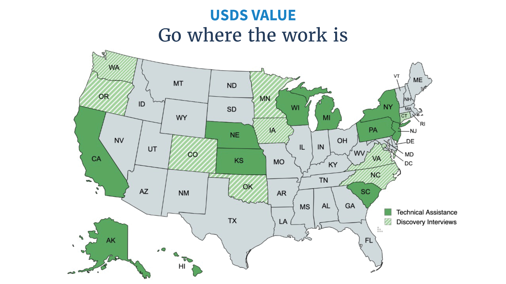
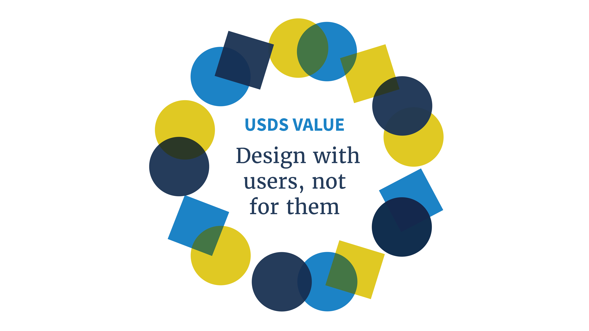

---
# Page template info (DO NOT EDIT)
layout: default
banner_file: banner--people-projects-lg.svg
banner_file_mobile: banner--people-projects-sm.svg
project_page: true

# Carousel (Edit this)
carousel_title: "Cutting red tape for Americans renewing their health coverage"
carousel_summary: "USDS worked with Centers for Medicaid and CHIP Services to partner with state Medicaid agencies to help improve state eligibility and enrollment systems."
carousel_image_name: project-medicaid-card.jpg

# Project detail page (Edit this)
title: "Cutting red tape for Americans renewing their health coverage"
agency: Health and Human Services | Centers for Medicaid and CHIP Services 
permalink: projects/healthcare-renewals

# Impact statement (Edit this)
impact_statement:
  - figure: "5+"
    unit: "M"
    description: |-
      Americans estimated to be renewed for health coverage with less red tape via *ex parte* processing in 2024
      
  - figure: "2+"
    unit: "M"
    description: |-
      hours of worker processing time estimated to be saved in 2024

  - figure: "10"
    unit: "+"
    description: |-
      states supported through in-depth technical assistance across diverse geographies, populations, and needs

  - figure: "over 400"
    unit: "K"
    description: |-
      children & families reinstated for coverage across 29 states as a result of actions taken by CMCS and supported by USDS
---

## Background

After the COVID-19 Public Health Emergency (PHE) ended, the [Facing a Financial Shock](https://www.performance.gov/cx/life-experiences/facing-a-financial-shock/) team at the U.S. Digital Service (USDS) partnered with the Center for Medicaid and CHIP Services (CMCS) and state Medicaid agencies to help improve eligibility and enrollment systems. By mobilizing a small strike team of implementers to analyze the software and processes that Medicaid uses to complete health coverage renewals, USDS helped CMCS and state teams tackle major challenges.
 

## Challenge

When the Medicaid continuous enrollment condition ended on March 31, 2023, following the end of the COVID-19 PHE, tens of millions of Americans with Medicaid and Children’s Health Insurance Program (CHIP) coverage needed to complete an annual eligibility renewal. State Medicaid agencies and frontline eligibility workers faced enormous operational challenges as they tried to resume renewals and manage rapidly increasing caseloads.

Meanwhile for many enrollees, this meant that maintaining their health coverage required navigating a complex and paper filled process for the first time in three years.

<blockquote class="pullquote" markdown="1">
That wasn’t difficult to understand. I knew I needed to renew and had a deadline. It’s once you actually go on to renew when things became extremely challenging.
 <footer>– Medicaid Enrollee</footer>
</blockquote>

## Solution

USDS and CMCS conducted interviews with 20 states to assess Medicaid agencies’ implementation needs, capacity, and renewal policies. They discovered that the legally required ex parte renewals process—which utilizes federal data and systems and state government data sources to renew eligible enrollees more efficiently and with less red tape—was inefficiently implemented across dozens of states and that states wanted help to make improvements.

While some states were able to complete over 50% of their renewals through the lower cost ex parte process, other states were completing less than 10% of renewals through the ex parte process.

This indicated that improving the software that powered the ex parte renewal process in states could yield significant time and cost savings for those states. It would be a win-win-win for eligible enrollees, state eligibility workers, and state agencies:

- **Eligible enrollees** would maintain continuous health coverage without unnecessary red tape and burdensome paperwork.

- **Eligibility workers** would need to process fewer paper submissions and could focus on more complex cases, improving accuracy and program integrity.

- **State agencies** would reduce their backlogs and costs, while making their systems more compliant with state and federal law.

The USDS-CMCS team ran its first on the ground pilot in Michigan, where they worked with state staff and vendors to pull and analyze data showing how enrollees were moving through the states’ systems. Together, they found several ways to better align the renewals software with state policy goals and integrate more data sources into the system. Once implemented, the changes improved system compliance, saved thousands of eligibility worker hours each month, and more than doubled the number of people being renewed with less red tape.

The success in Michigan triggered interest from more state Medicaid agencies, and the USDS-CMCS team rapidly scaled to meet the demand. The team ran on the ground implementation sprints with Wisconsin, Hawaii, California, New York, South Carolina, Kansas, and New Jersey. At the same time, the team provided virtual support and mobilized other organizations, like the Digital Service at CMS, to leverage the USDS approaching even more states. This virtual work helped improve the renewal processes in Alaska, Nebraska, and Pennsylvania. 

*Meeting with state civil servants where they are means we can partner to create lasting change.*

USDS and CMCS worked alongside state staff to diagnose problems in each state’s renewal system and rapidly implemented improvements. Together, the teams used data to construct a state’s renewal funnel to give state policy teams more insight into and control over their renewal software and processes. Using this data to prioritize focus, the team found ways to improve the software logic to better comply with state and federal law, integrate more data sources into systems to improve accuracy and reduce manual eligibility worker burden, and empower state agencies to manage and lead their vendors. Together, the teams worked to close the most significant implementation gaps—ensuring states’ policy goals were realized by the lines of code in their software.

For example, the USDS-CMCS team worked on the ground with California to analyze renewal data and identify strategies to ensure that CMCS policy flexibilities were accurately and efficiently implemented in eligibility and enrollment systems. As detailed in a case study [LINK] by the California Department of Health Care Services, the improvements that the teams made increased California’s ex parte rate from an average of 34% from June to November to 66% in December 2023. With the improvement in ex parte processing, California’s disenrollments dropped from an average of 20% to 9% in December.

<blockquote class="pullquote" markdown="1">
[USDS] quickly walked our business and system teams through the identified areas and executed technical support to help make the changes as quickly as possible. We were able to implement the system change in two weeks and the next month, our ex parte rate had increased by 15%! 

In addition to the systems-based support, their team of human-centered designers met with our outreach team and community health workers to better understand the challenges with our current renewal form and identify improvements to our form that would have the greatest positive impact within the diverse communities we serve.

 <footer>– State Medicaid Director</footer>
</blockquote>

The teams also improved the renewal customer experience, redesigning renewal websites, improving communications and notices, and supporting end-to-end process improvements. In a matter of weeks, the USDS-CMCS team and state agencies would identify, align on, and execute the highest impact opportunities together. 

*Meeting with community organizations and enrollees across the country illuminated opportunities where human-centered design could drive better outcomes.*

## Impact

As of January 2024, partner states that have implemented changes with the USDS-CMCS team increased their monthly ex parte rates by an average of 21% and decreased their procedural termination rate by 10%. In 2024, these improvements are estimated to save over two million hours of state worker time and improve the experience of maintaining health coverage for millions of eligible Americans. 

These changes have made ex parte software more accurate and improved state policy makers’ control over implementation—ultimately improving systems compliance. By reducing caseloads these changes have allowed eligibility workers more time to focus on complex cases and improve program integrity. 

While diving into state ex parte systems, USDS and CMCS also uncovered and fixed a [significant common system error](https://www.hhs.gov/about/news/2023/09/21/coverage-half-million-children-families-reinstated-thanks-hhs-swift-action.html) that impacted 29 states and was responsible for improper loss of coverage for over 400,000 children and families in Medicaid and CHIP. As a result of this fix, improperly disenrolled individuals regained their coverage and retroactively had their healthcare coverage reinstated for their period of improper disenrollment.

Importantly, many of these improvements to ex parte systems and renewal processes will continue to benefit states over the long term. More compliant and accurate state systems will continue to save millions of hours of state worker time each year and keep millions of eligible Americans enrolled in their health coverage with less red tape.
