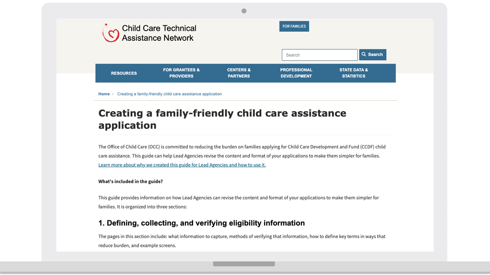
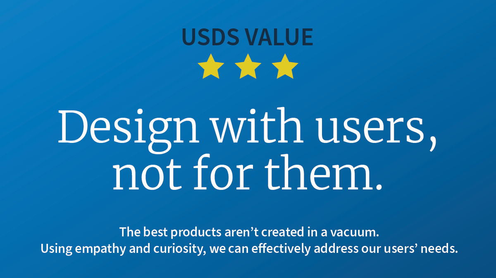
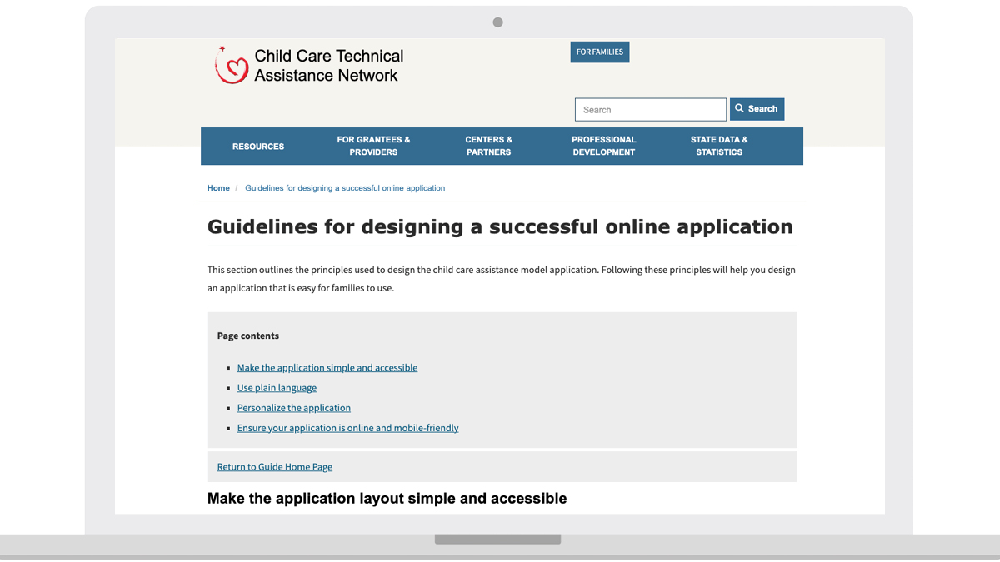

---
# Page template info (DO NOT EDIT)
layout: default
banner_file: banner--people-projects-lg.svg
banner_file_mobile: banner--people-projects-sm.svg
project_page: true

# Carousel (Edit this)
carousel_title: "Updating the child care application process"
carousel_summary: "The Child Care and Development Fund (CCDF) is part of the Department of Health and Human Services Administration for Children and Families (ACF). The program aims to assist low-income families by providing financial aid to access child care."
carousel_image_name: project-acf-card.jpg

# Project detail page (Edit this)
title: "Using human-centered solutions to optimize and modernize the child care application process"
agency: Health and Human Services
permalink: projects/acf
project_url: URL or keep blank if not applicable

# Impact statement (Edit this)
impact_statement:
  - figure: "~1.4"
    unit: "M"
    description: |-
      children under 13 from roughly 857,00 low-income
 working families are served by the Child Care and Development Fund (CCDF) [*Source*](https://www.acf.hhs.gov/occ/fact-sheet/characteristics-families-served-child-care-and-development-fund-ccdf-based)

      
  - figure: "<4+"
    unit: "week"
    description: |-
      wait time that The Guide to Creating a Family Friendly Child Care Assistance Application aims to significantly reduce during the application process *Source: USDS research*

  - figure: ~20-30
    unit: "states"
    description: |-
      showed interest in implementing these updates to their CCDF applications after presenting the guide at State and Territory Administrators Meeting (STAM) *Source: USDS research*

  - figure: "~1"
    unit: "year
    description: |-
      after the Biden-Harris Administration signed the Executive Order on Improving Customer Experience and Service Delivery for the American People, USDS and Administration for Children and Families (ACF) released the Guide to Creating a Family Friendly Child Care Assistance Application [*Source*](https://www.whitehouse.gov/briefing-room/presidential-actions/2021/12/13/executive-order-on-transforming-federal-customer-experience-and-service-delivery-to-rebuild-trust-in-government/)

---

## Background

The Child Care and Development Fund (CCDF) is a child care assistance program that operates through a partnership between federal and state governments. It is administered by states, territories, and tribal nations, with funding and support from the Office of Child Care (OCC)—part of the Department of Health and Human Services Administration for Children and Families (ACF).

The program aims to assist low-income families by providing financial aid to access child care facilities. This assistance can help parents work or attend job training and educational programs.

*This is a caption for an image.*

While the CCDF is federally funded, each state, territory, or tribal nation administers the program for its residents, which includes:
- Creating an application
- Collecting and processing applications
- Determining eligibility requirements
- Sending payments to providers

Each locality approaches the process differently. For the low-income families seeking support, the process can be burdensome and can place a huge barrier between them and the assistance they request. For example, some states require an in-person interview or an original, hard-copy birth certificate. These requirements make it difficult for busy, resource-strapped families to apply, qualify, and get assistance quickly.

## The Challenge

About one million American families receive child care assistance from the federal government. However, there is potential for this number to increase if the application process was made simpler for families and easier for state, territory, and tribal nation staff to approve. The transformation and modernization of this critical public-facing service is needed.

The U.S. Digital Service (USDS) and ACF partnered to tackle this challenge.

During the early stages of the project, it became apparent there were two significant challenges: 
1.	The difficulty families face navigating the application process
2.	The difficulty that staff working in states, territories, or tribal nations have when approving and processing applications

## The Solution

Effective design is design that caters to all individuals. Therefore, the USDS team prioritized research to ensure that both users and staff managing the guide felt informed, empowered, prepared, and in control prior to implementation.

### Research

With the challenges in mind, USDS began conducting research and discovered a strong appetite for improvement from state administrators who wanted to make applications process easier but needed clarification on what was allowed under the federal program.

<blockquote class="pullquote" markdown="1">
I can't think of one state call we had where it wasn't clear they were so dedicated to the families. Everyone wanted this to be a better process. There was no convincing involved. It was just a matter of feasibility.
 <footer>– Allison Abbott, Design and Research at USDS!</footer>
</blockquote>

USDS Designer and Researcher Allison Abbott recalls that state staffers felt passionate about providing people with an optimized, streamlined process but needed more bandwidth and headcount to step back and reimagine the applicant's experience. 

"What struck me was *how much* states deeply wanted to make an easier experience for families to access and apply for many reasons: from generous, good hearts to cost-saving measures," Abbott said.

USDS saw an opportunity to make an impact at the federal level. They would take on some of that burden and create a template and guide that establishes a flywheel that states could run with without impacting their level of service. This was the birth of the [Guide to Creating a Family Friendly Child Care Assistance Application](https://childcareta.acf.hhs.gov/creating-family-friendly-child-care-assistance-application).

At the federal level, there was an opportunity to create momentum with a guide that states could run with, to help address broken processes they've wanted to fix but didn’t have the resources to do so.

### Execution

USDS partnered with ACF's policy and subject matter experts to create a Model Child Care Assistance Application and eligibility verification practices that met federal guidelines and demonstrated the "art of what's possible." But what steps did they take to get there? Let's break them down.

*This is a caption for an image.*

<blockquote class="pullquote" markdown="1">
We talked to the actual users of this Guide. They were the humans that would read this guide, use this guide, and implement the recommendations from this guide.
 <footer>– Coulton Bunney, Design and Research at USDS</footer>
</blockquote>

When developing the guide, USDS Designer and Researcher Coulton Bunney shared that the team brought a human-centered approach to the work in many ways. He highlighted three ways that, together, helped the team produce a practical guide: 
1.	Interviewed state staffers at lead agencies  
2.	Conducted user research with the families who have applied for this benefit recently and gathered feedback and stories from their experience  
3.	Used plain language principles in both the applicant- and the state-facing deliverables

Bunney and Abbott also shared that the design of the guide required a multi-layered approach: Designing for the families and the state administrators.

Abbott said, "As a user researcher, working directly with families will always be the foundation upon which we design and deliver services. It's the status quo." She continued that while you practice human-centered design, you must build on that foundation and then consider the next layer—the people delivering the service to families and how to design for them, too. 

Bunney and Abbott agreed that the end user is essential, but designing for the front-line people is important, too, because they are the ones responsible for delivering the service. 

*This is a caption for an image.*

### Insights

One notable discovery was that the interpretation of what was required in an application, including language for asking applicants for information, varied widely from state to state. As a result, during the creation of the guide, states expressed a lot of interest in learning both the federal government's interpretation of the language and what other states were already doing. 

USDS increased transparency by highlighting some of the least burdensome ways states ask applicants for information. This resulted in states being able to point to the federal government's language and other states' language to show their legal teams what was working.

## The Impact

This digital resource will improve the experience of the application process for families and the state staff members. While ultimately, it is up to each state, territory, or tribal nation to adopt the recommendations in the guide, USDS is optimistic this will be a valuable resource for states. Further, they hope states, territories, and tribal nations will implement the actionable steps outlined in the guide to reduce the burden for families because it was built on a solid foundation of user research. 

<blockquote class="pullquote" markdown="1">
I attended the STAM session and was anxiously awaiting this guide. You did not disappoint. This guide and sample application are awesome!
 <footer>– A leader from Washington state</footer>
</blockquote>

The reception was overwhelmingly positive when the guide was previewed with state leaders. For example, a leader from Washington State sent this note the morning it launched: "I attended the STAM (State and Territory Administrators Meeting) session and was anxiously awaiting this guide. You did not disappoint. This guide and sample application are awesome!" 
Additionally, state child care offices are expressing interest in this work. And some states are expanding support resources to help put these practices to work and improve efforts to reduce the burden on working families.

## Press

- [ACF Launches New Tool for States to Make Child Care Assistance Easier for Families to Access | The Administration for Children and Families (hhs.gov)](https://www.acf.hhs.gov/media/press/2022/media/acf-launches-new-tool-states-make-child-care-assistance-easier-families)

