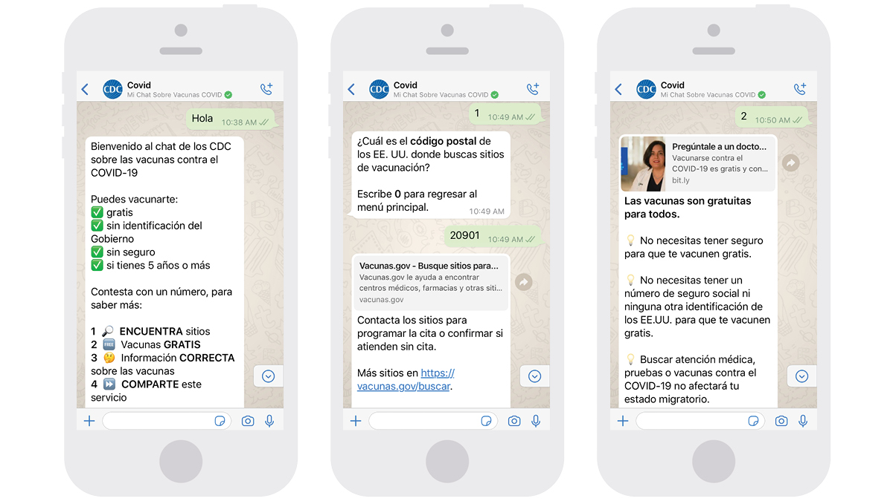
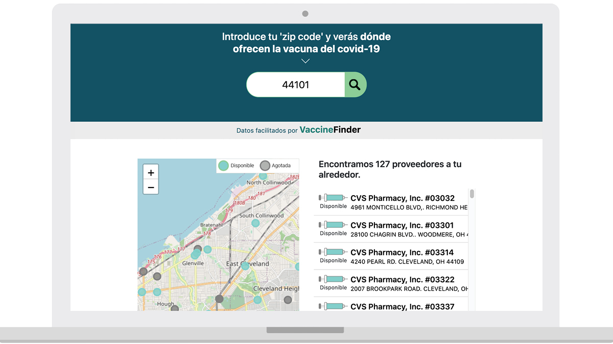

---
# Page template info (DO NOT EDIT)
layout: default
banner_file: banner--people-projects-lg.svg
banner_file_mobile: banner--people-projects-sm.svg
project_page: true

# Carousel (Edit this)
carousel_title: "Critical code: building COVID-19 vaccine finder tools"
carousel_summary: "With the American public eager for COVID-19 vaccinations, The White House partnered with the U.S. Digital Service, the Centers for Disease Control & Prevention, the Department of Health & Human Services, and Boston Children’s Hospital to launch a fleet of tools connecting people to life-saving vaccines."
carousel_image_name: project-vaccines-card.jpg

# Project detail page (Edit this)
title: "Critical code: building COVID-19 vaccine finder tools"
agency: Health and Human Services
permalink: projects/vaccines-dot-gov
project_url: https://www.vaccines.gov/

# Impact statement (Edit this)
impact_statement:
  - figure: 105
    unit: "M"
    description: |-
      People visited Vaccines.gov or Vacunas.gov since its launch
      
  - figure: 2.4
    unit: "M"
    description: |-
      SMS messages (text and WhatsApp) received since launch
      
  - figure: 776
    unit: "K"
    description: |-
      Call Center inquiries answered since launch
---

## The Challenge

After nearly a year of climbing cases, Americans were understandably eager to find COVID-19 vaccines when they were approved for emergency use by the Food and Drug Administration in early 2021. With no national COVID-19 vaccine search solution and each state rolling out their own websites and eligibility criteria, both demand and confusion were high.

The incoming Biden-Harris Administration identified a vaccine finder tool as a top priority. The White House COVID-19 Response Team partnered with the U.S. Digital Service, the Centers for Disease Control & Prevention (CDC), the Department of Health & Human Services (HHS), Boston Children’s Hospital (BCH), and Castlight Health to get it done.

## The Solution
**Leveraging Existing Tech**

The team decided to repurpose an existing vaccine finder tool the CDC created with BCH pre-COVID to help people find routine vaccinations (e.g., flu vaccines). The tool was built for a similar use case, but it was not designed for the high volume of traffic and diversity of users we knew to expect. 

<blockquote class="pullquote" markdown="1">
We examined the product under a microscope, thinking about everything USDS knows about product launches and checking for things like usability and stability.
 <footer>– Project Lead, Hannah Pyper</footer>
</blockquote>

USDS and our agency partners worked to prepare the site for a wide range of users and high volumes of traffic by making the following updates:
- Simplified language so it was inclusive and plain
- Made code and design changes in line with Section 508 – the federal government’s accessibility standard for people with disabilities. These updates also made the site easier to use for everyone, regardless of physical abilities.
- Optimized site performance so users could quickly access the site on mobile devices and with slow internet connections.

**From One Tool to Many**

It became clear from user research that one website wouldn’t meet the needs of the public and that we also needed ways to reach people without Internet.

In response to user research, the team advocated for and created a Spanish-language website, [Vacunas.gov](https://www.vacunas.gov/), as well as a WhatsApp chatbot to reach Spanish speakers. The team also launched a call center and an SMS short code tool, to reach those who do not have Internet or preferred to access their information offline.  

## The Impact
**Preparing for 100 Million Eyes**

How do you prepare for an onslaught of web traffic right away? Knowing that President Biden would mention the website in a speech on the anniversary of the COVID-19 pandemic, systems engineers readied the site to host 100 million users simultaneously. Traffic never climbed that high, but being prepared for such a high number of visitors ensured the success of the launch. 

**Open Data to Reach More People**

The team also made sure that the underlying data – a comprehensive list of all locations getting COVID-19 vaccines – was publicly accessible via an API on [data.cdc.gov](https://data.cdc.gov/browse?category=Vaccinations). Partners such as Google, Apple, and Univision used this data to integrate vaccine locations into their own products. This effort allowed an even wider swath of people to access vaccine availability data, in a way that was most convenient for them.

*[See the vaccine finder tool in action](https://www.univision.com/noticias/salud/donde-hay-vacunas-contra-el-covid-19-disponibles-en-mi-zona).*

**Raising the Bar for Government Websites**

Media drew parallels between Healthcare.gov and Vaccines.gov, as the President announced the site. Mina Hsiang, USDS’ current administrator, who worked on both Healthcare.gov and Vaccines.gov, said the government has come a long way since 2014. Chiefly, technologists had a seat at the table from the beginning of Vaccines.gov, unlike with Healthcare.gov.

“With [Vaccines.gov](https://www.vaccines.gov/), USDS tech consultants came in the room at the outset,” said Hsiang. “Government has learned a lot since Healthcare.gov. This is another step in the evolution &mdash; government has continued to learn through this process.”

## Press

- [Need A COVID-19 Vaccine? Biden Admin Launches GETVAX Text Line And Other Search Tools](https://www.npr.org/2021/04/30/992591012/need-a-covid-19-vaccine-biden-admin-launches-getvax-textline-and-other-search-to)
- [Biden administration rolls out COVID-19 vaccine text-line](https://www.healthcareitnews.com/news/biden-administration-rolls-out-covid-19-vaccine-textline)
- [To Bridge The Digital Divide, Biden Administration Launches Vaccine Hotline](https://www.npr.org/2021/05/09/994885742/to-bridge-the-digital-divide-biden-administration-launches-vaccine-hotline)
