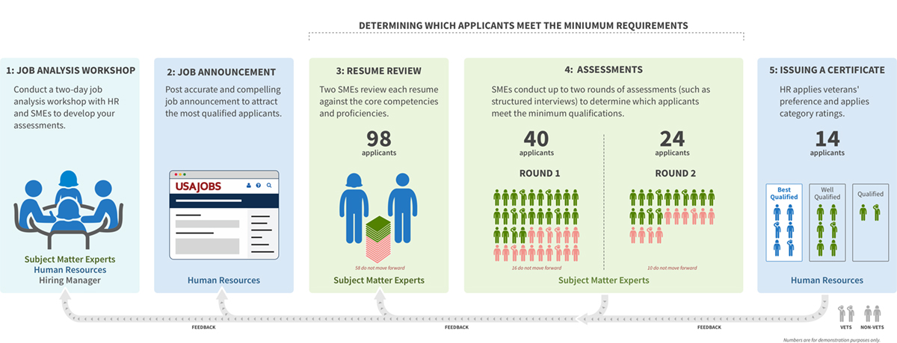
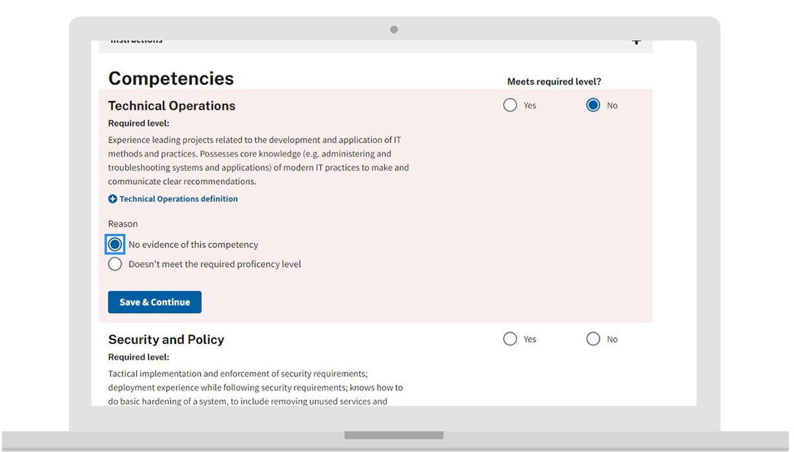

---
# Page template info (DO NOT EDIT)
layout: default
banner_file: banner--people-projects-lg.svg
banner_file_mobile: banner--people-projects-sm.svg
project_page: true

# Carousel (Edit this)
carousel_title: "Changing how the government hires technical talent"
carousel_summary: "We helped develop a process that allows HR to leverage subject matter experts to evaluate candidates for specialized roles. The result restores fair and open access for all applicants, shortens the hiring timeline, and ensures applicants are truly qualified."
carousel_image_name: project-smeqa-card.jpg
# accessibility text for image
carousel_image_alt_text: "Project photo"
# should show on home page. ordered by date prefix in filename
carousel_show: true

# Project detail page (Edit this)
title: "Changing how the government hires technical talent"
agency: Cross-agency
permalink: projects/smeqa
project_url: 

# Impact statement (Edit this)
impact_statement:
  - figure: "45 &rarr; 16"
    unit: ""
    description: |-
      Change in average number of days to make a candidate selection in the Department of Interior pilot

  - figure: 52
    unit: "%"
    description: |-
      of qualified applicants were ultimately hired in the Department of Interior pilot (versus zero from baseline data)
---

## The Challenge

Many federal agencies hiring people into civil service positions struggle to determine who has the required expertise. HR specialists often determine whether applicants are qualified based on self‑assessments and federal‑style resumes that are regularly longer than five pages. When hiring managers receive lists of candidates they don’t consider qualified for the open positions, they often cancel the entire hiring effort, wasting time and resources for the government and the public. Hiring managers with negative experiences sometimes avoid competitive hiring, which may limit how both public‑ and private‑sector applicants are able to find positions in the federal government.

<blockquote class="pullquote" markdown="1">
It could be game‑changing. Hiring scientists, any specialized skill…I would absolutely recommend my office use it.
 <footer>– Subject Matter Expert, Dept. of Health & Human Services</footer>
</blockquote>

## The Solution

The USDS team hypothesized that having subject matter experts (SMEs) assess qualification early in the process would help hiring managers receive higher quality candidate lists and hire qualified applicants more quickly. In January 2019, USDS and the Office of Personnel Management (OPM) partnered to test Subject Matter Expert Qualification Assessments (SME‑QA), a process where SMEs develop the required qualifications for the position alongside HR specialists. The SMEs then use their expertise to review applicant resumes and phone interview transcripts to determine whether the applicant meets the qualifications.
Only the applicants who pass these assessment hurdles are considered qualified and eligible for preference according to OPM delegated examining rules.

## The Impact

Starting in early 2019, USDS tested the SME‑QA process with the Department of Health and Human Services (HHS) and the National Park Service at the Department of the Interior (DOI). Compared with data from previous hiring events at the agencies, SMEs participating in both SME‑QA pilots found fewer applicants qualified (11% at DOI and 22% at HHS), but ultimately selected more applicants to be hired (13 at DOI and 7 at HHS). The applicants hired through the pilots included Veterans and represented diversity in race, age, and gender.
 
The OPM Director issued a [memo in September 2019](https://chcoc.gov/content/improving-federal-hiring-through-use-effective-assessment-strategies-advance-mission) informing agencies that SMEs can partner with HR specialists to review resumes and assess applicants using structured interviews before they’re determined to be qualified and receive Veterans’ preference. USDS has continued to pilot the SME‑QA process with several large federal agencies and is working to build and test tools to ease the assessment process for SMEs.

*This is a SME resume review tool USDS built to reduce bias in the resume review process. It is one of the new features that USDS is building to provide for SME participation in the qualifications process.*

## Press

- [USDS, OPM test new ideas for improving hiring outcomes](https://www.govloop.com/usds-opm-test-new-ideas-for-improving-hiring-outcomes/)
- [U.S. Digital Service recruitment reforms set for roll-out](https://www.globalgovernmentforum.com/us-digital-service-recruitment-reforms-set-for-roll-out/)
- [USDS developing innovative approach to private-sector hiring](https://governmentciomedia.com/usds-developing-innovative-approach-private-sector-hiring)
- [Agencies find higher quality candidates under new Digital Service, OPM hiring pilot](https://federalnewsnetwork.com/hiring-retention/2019/10/agencies-find-higher-quality-candidates-under-new-digital-service-opm-hiring-pilot/)
- [USAJOBS aims to provide applicants with better job updates](https://www.fedscoop.com/usajobs-job-updates-2020/)
