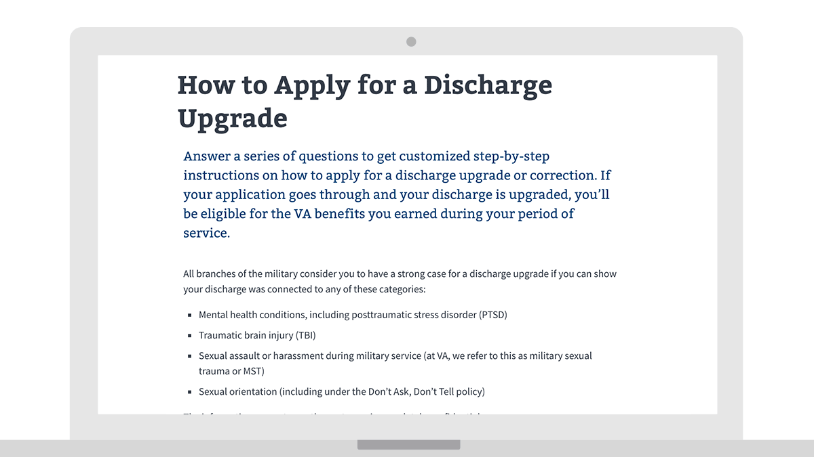
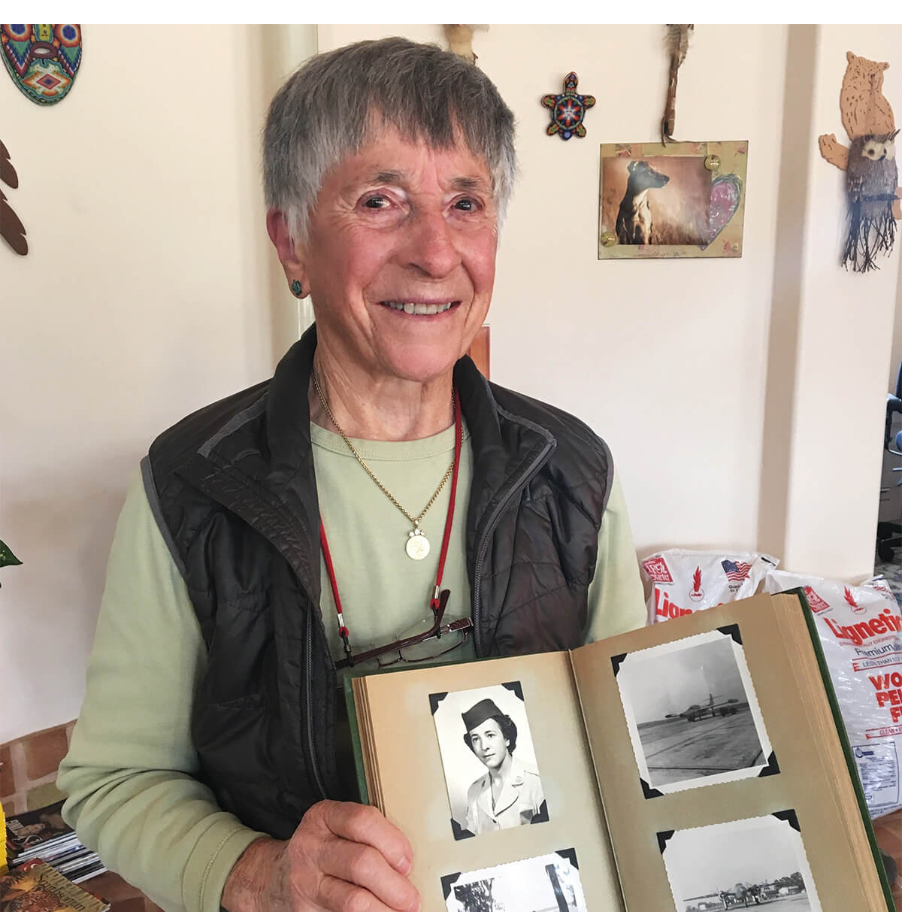

---
# Page template info (DO NOT EDIT)
layout: default
banner_file: banner--people-projects-lg.svg
banner_file_mobile: banner--people-projects-sm.svg
project_page: true

# Carousel (Edit this)
carousel_title: "Helping Veterans upgrade their Discharge Status"
carousel_summary: "A customized, plain language tool gives Veterans step-by-step guidance for submitting a strong application to upgrade their discharge status."
carousel_image_name: project-va-discharge-upgrade-card.jpg
# accessibility text for image
carousel_image_alt_text: "Project photo"
# should show on home page. ordered by date prefix in filename
carousel_show: false

# Project detail page (Edit this)
title: "Helping Veterans upgrade their Discharge Status"
agency: Veterans Affairs
permalink: projects/discharge-upgrade-tool
project_url: https://www.va.gov/discharge-upgrade-instructions

# The Impact (Edit this)
impact_statement:
  - figure: "43,714"
    unit: " "
    description: |-
      Veterans used the tool within the first eight months of launch

---

## The Challenge

An estimated 75,000 of our nation’s Veterans were less than honorably discharged as a result of issues including their sexual orientation, undiagnosed post-traumatic stress disorder (PTSD), traumatic brain injury (TBI), or being victims of sexual assault. A less than honorable discharge not only keeps a Veteran from receiving care and benefits, but for many it also prevents reenlistment, eligibility for a competitive job, or reintegration to civilian life. Often, it also means that society doesn't recognize them as a Veteran. The military indicated that Veterans discharged under these circumstances were likely to receive an upgraded status if they submitted a strong application, but the application process was complex. It was difficult for users to know which form to submit, what evidence to provide, and what military board to submit to.

## The Solution

Digital Service at Veterans Affairs led a coalition of concerned employees across Veterans Affairs and the Department of Defense to build a tool that guides users through 9 questions and provides individualized results based on their responses. The customized plain language offers clear, step-by-step guidance on how a Veteran could present a strong application to upgrade their discharge status.

<blockquote class="pullquote" markdown="1">
Nothing would make me prouder than getting my other than honorable discharge changed...I simply want the ability of saying, yes, I served proudly, and being able to state in an application that I served.
 <footer>– a Veteran in response to an American Legion story introducing the new tool</footer>
</blockquote>

*Former Airman 2nd Class Helen James, a radio operator, was dishonorably discharged of the Air Force in 1955 because she was a lesbian. She recently received on upgraded honorable discharge (Image courtesy of Legal Aid at Work).*

## Press
- [Vets kicked out for being gay can upgrade their discharges](https://www.ebar.com/news/news//288378)
- [VA release online tool to help vets with discharge upgrade process](https://dod.defense.gov/News/Article/Article/1424677/dod-va-release-online-tool-to-help-vets-with-discharge-upgrade-process/)
- [New online tool will provide veterans with customized instructions for discharge upgrade process](https://www.va.gov/opa/pressrel/pressrelease.cfm?id=4001)
