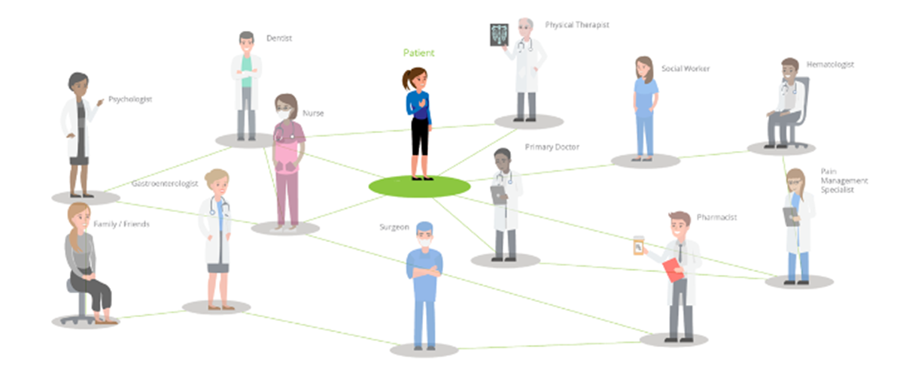
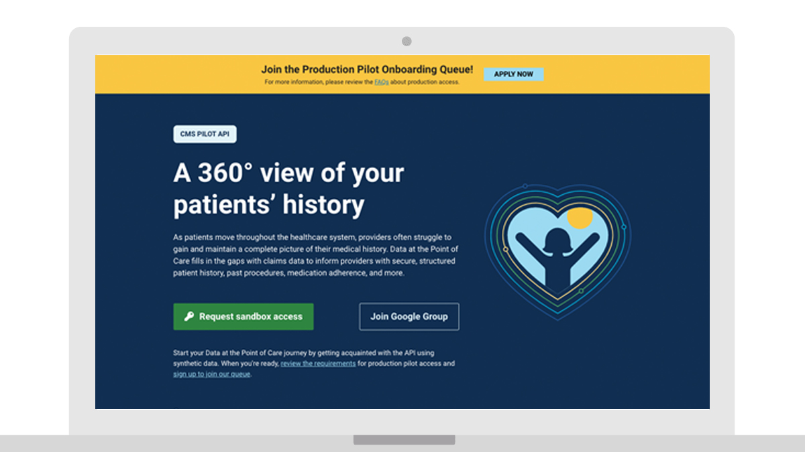
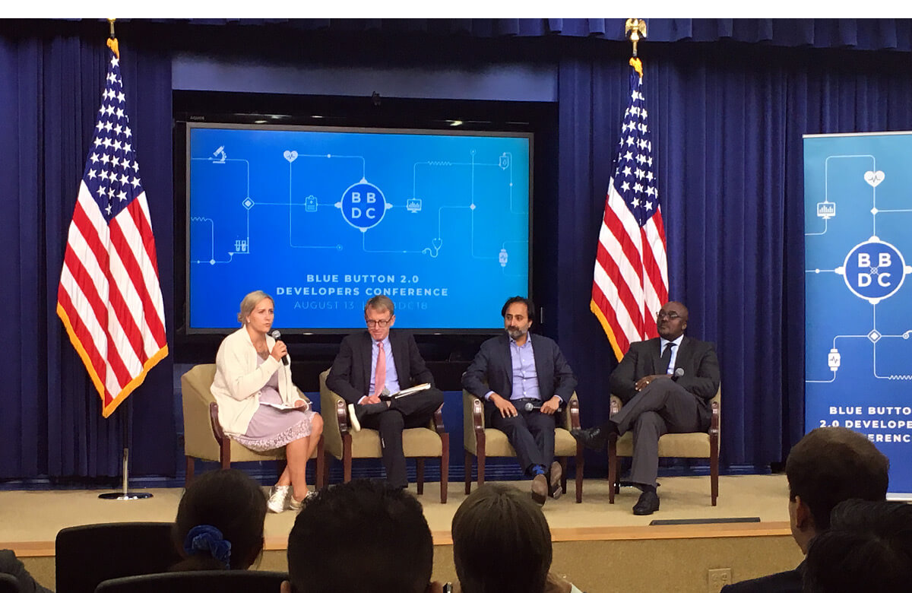

---
# Page template info (DO NOT EDIT)
layout: default
banner_file: banner--people-projects-lg.svg
banner_file_mobile: banner--people-projects-sm.svg
project_page: true

# Carousel (Edit this)
carousel_title: "Empowering beneficiaries with their own health data"
carousel_summary: "Leveraging CMS APIs, providers can view of their patients’ full healthcare history without patient intervention. Providers save valuable time that they can better spend talking to patients and preventing conflicts or gaps in care."
carousel_image_name: project-hhs-bbdpc-card.jpg

# Project detail page (Edit this)
title: "Empowering beneficiaries with their own health data"
agency: Health and Human Services
permalink: projects/blue-button-2
project_url: https://dpc.cms.gov/

# Impact statement (Edit this)
impact_statement:
  - figure: "53"
    unit: "M"
    description: |-
      Americans reliant on Medicare claims

  - figure: 1000
    unit: "+"
    description: |-
      Developers using Blue Button API
---

## The Challenge

Medicare claims data serves as a running health record for 53 million Americans. As patients move through the health care system, providers often struggle to gain and maintain a complete picture of their medical history. Without a unifying system, patients bear the burden of maintaining their medical records and briefing each new provider on their medical history and current care regimen. Doing so wastes valuable time during medical appointments that could be better spent addressing the patient’s current medical issues.

## The Solution

The Centers for Medicare & Medicaid Services tapped USDS to work alongside them to build Blue Button, an application programming interface (API) that opened Medicare claims data to third-party developers. Blue Button allows beneficiaries to access data that lets them and their caregivers monitor drug conflicts, view visit history, and track progress towards desired healthcare outcomes. Three years later, building on top of data made available through the Blue Button API, a small USDS team created and launched Data at the Point of Care, making patients’ Medicare claims data available to their providers. 

## The Impact

Blue Button and Data at the Point of Care help give beneficiaries and their providers a 360‑degree view of past diagnoses, procedures, and medications. Instead of forcing patients to recall and retell their entire medical history at each visit, providers can use Medicare claims information to confirm a patient’s understanding of their medical history, fill in gaps in care, and improve patient safety. This not only enables Americans to make better medical decisions (such as monitor for drug conflicts and refill prescriptions) but also reduces the government’s burden to build and maintain technically complex software solutions for every possible use case. 

*In August 2018, USDS hosted the Blue Button Developer Conference at the White House where Amazon, Microsoft, Oracle, Google, Salesforce, and IBM all pledged to use the data standard Blue Button 2.0 is built on.*

## Press

- [CMS to host Blue Button 2.0 conference](https://www.healthcareitnews.com/news/cms-host-blue-button-20-conference)
- [New from the Digital Service team at CMS: Blue Button 2.0 is a Medicare claims data API](https://www.fedscoop.com/embargoed-new-digital-service-team-cms-blue-button-2-0-medicare-claims-data-api/)
- [CMS, USDS innovators on the future of Blue Button 2.0](https://www.healthcareitnews.com/news/cms-usds-innovators-future-blue-button-20)
- [A world without prior authorization — How analytics are helping health systems transition to value-based care](https://www.beckershospitalreview.com/payer-issues/a-world-without-prior-authorization-how-analytics-are-helping-health-systems-transition-to-value-based-care.html)
- [Major reformations of the last decade that will shape US healthcare in 2020](https://www.mobihealthnews.com/news/major-reformations-last-decade-will-shape-us-healthcare-2020)
- [Medicaid data made public for the first time](https://www.fedscoop.com/cms-medicaid-data-public/)
