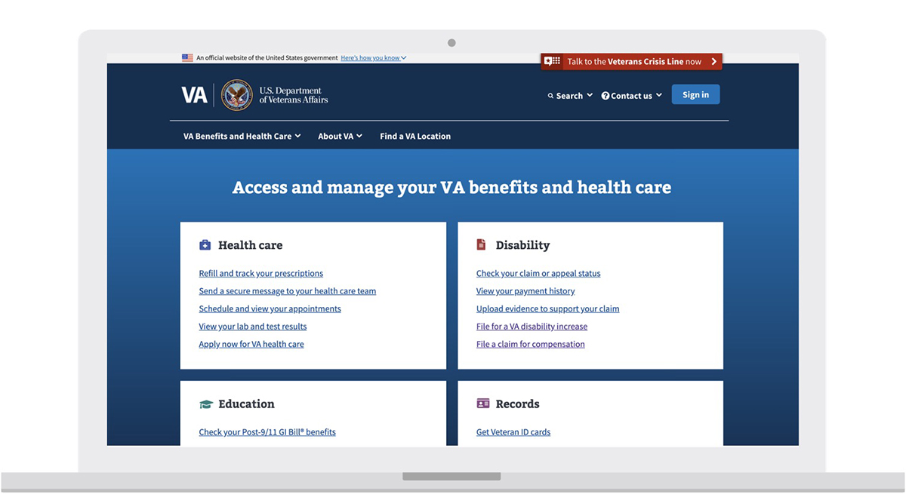

---
# Page template info (DO NOT EDIT)
layout: default
banner_file: banner--people-projects-lg.svg
banner_file_mobile: banner--people-projects-sm.svg
project_page: true

# Carousel (Edit this)
carousel_title: "Simplifying Veteran‑facing services through VA.gov"
carousel_summary: "Each month, over 10 million people attempt to access the digital tools and content at the Department of Veterans Affairs (VA) and have historically struggled to find what they’re looking for. Digital modernization efforts needed to focus on improving the user experience."
carousel_image_name: project-va-va-dot-gov-card2.jpg

# Project detail page (Edit this)
title: "Simplifying Veteran‑facing services through VA.gov"
agency: Veterans Affairs
permalink: projects/va-dot-gov
project_url: https://va.gov

# Impact statement (Edit this)
impact_statement:
  - figure: "30"
    unit: "%"
    description: |-
      increase in the customer satisfaction score for the modernized pages, from an average of 53 to over 69

  - figure: 1.7
    unit: "M"
    description: |-
      logins every month on VA.gov
---

## The Challenge

Each month, over 10 million people attempt to access the digital tools and content at the Department of Veterans Affairs (VA) and have historically struggled to find what they’re looking for. Veterans experienced disjointed navigation between sites and pages, and found that the website was focused more on the structure of the agency than on their needs as Veterans. Digital modernization efforts needed to focus on improving the user experience.

## The Solution

The USDS team at VA and the Office of the Chief Technology Officer partnered with teams across VA to focus on quickly connecting users to the most commonly needed services and information VA offers. The result was the new VA.gov website, built with the input of over 5,000 Veterans, service members, caregivers, and family members.

## The Impact

Since the website relaunch in November 2018, VA.gov has supported nearly 1.7 million logins each month. Veterans have checked the status of their claims 1.6 million times, submitted more than 50,000 applications for education benefits, and applied for health care more than 9,000 times. In an interview with FedScoop at the time of the launch, VA Secretary Robert Wilkie said, 
“...my main priority as Secretary is simple—to give our customers the best possible experience the minute they encounter VA. Today, we’re doing just that with the new VA.gov—the new online front door of your Department of Veterans Affairs.”

## Press

- [The new VA.gov shows what’s possible for government tech after the Healthcare.gov disaster](https://qz.com/1464919/new-veterans-affairs-site-va-gov-avoids-healthcare-gov-disaster/)
- [How a quick fix skyrocketed VA.gov satisfaction scores](https://www.federaltimes.com/it-networks/2019/02/14/how-a-quick-fix-skyrocketed-vagov-satisfaction-scores/)
- [USDS continues IT Transformation at VA](https://governmentciomedia.com/usds-continues-it-transformation-va)
