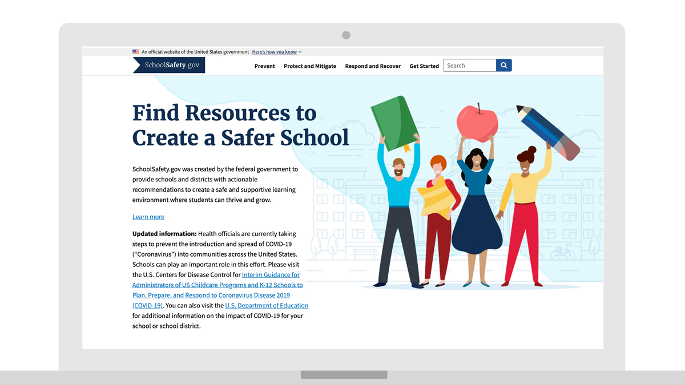

---
# Page template info (DO NOT EDIT)
layout: default
banner_file: banner--people-projects-lg.svg
banner_file_mobile: banner--people-projects-sm.svg
project_page: true

# Carousel (Edit this)
carousel_title: "Helping schools keep students safe"
carousel_summary: "A website that empowers emergency managers and K–12 administrators with the information they need to improve school safety."
carousel_image_name: project-dhs-school-safety-card.jpg

# Project detail page (Edit this)
title: "Helping schools keep students safe"
agency: Department of Homeland Security
permalink: projects/school-safety
project_url: https://schoolsafety.gov

# Impact statement (Edit this)
impact_statement:
  - figure: "411"
    unit: ""
    description: |-
      Action plans created in the first month after SchoolSafety.gov was released

---

## The Challenge

Over the past decade, K–12 schools across the United States have experienced 464 shooting incidents. In 2018, after the shooting at Marjory Stoneman Douglas High School in Parkland, Florida, one of the deadliest school shootings in U.S. history, the Federal Commission on School Safety recommended that the federal government share best practices to advance school safety.

## The Solution

Working with the Department of Homeland Security (DHS), USDS employed a human‑centered design approach to understand the needs of schools and how best to share school safety information with them. With this research, USDS partnered with DHS to launch SchoolSafety.gov 
in February 2020, a website that empowers emergency managers and K–12 administrators with the information they need to improve school safety. “Because every school community has its own unique needs, SchoolSafety.gov equips decision makers with resources for developing, customizing, and implementing actionable school safety plans,” said U.S. Secretary of Education Betsy DeVos.

## Press

- [Federal agencies launch website on school safety and security](https://www.safetyandhealthmagazine.com/articles/19532-trump-administration-launches-school-safety-website)
- [Parkland fathers help launch SchoolSafety.gov ahead of 2-year anniversary](https://cbs12.com/news/local/parkland-fathers-launch-school-safety-initiative-fund-ahead-of-2-year-anniversary)
- [Trump Administration launches school safety website](https://homelandprepnews.com/stories/44240-trump-administration-launches-school-safety-website/)
- [SchoolSafety.gov launches to help educators, administrators, parents, and law enforcement prepare for threats](https://www.ed.gov/news/press-releases/schoolsafetygov-launches-help-educators-administrators-parents-and-law-enforcement-prepare-threats)
