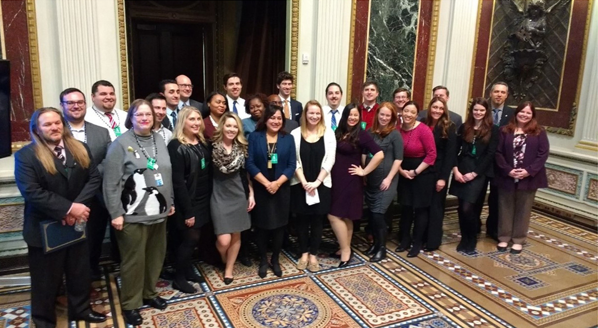

---
# Page template info (DO NOT EDIT)
layout: default
banner_file: banner--people-projects-lg.svg
banner_file_mobile: banner--people-projects-sm.svg
project_page: true

# Carousel (Edit this)
carousel_title: "Improving how the government buys technology"
carousel_summary: "As the pace of innovation has accelerated, the government’s ability to meet people’s expectations of functional digital solutions has not kept pace. To meet this demand, we created an immersive development and training program to improve digital services acquisition expertise across government agencies."
carousel_image_name: project-ditap-card.jpg
# accessibility text for image
carousel_image_alt_text: "Project photo"
# should show on home page. ordered by date prefix in filename
carousel_show: false

# Project detail page (Edit this)
title: "Improving how the government buys technology"
agency: Cross-agency
permalink: projects/ditap
project_url: 

# Impact statement (Edit this)
impact_statement:
  - figure: "400"
    unit: "+"
    description: |-
      People will have graduated from our DITAP program by end of FY 2020

  - figure: 4
    unit: "x"
    description: |-
      Growth of the Digital Acquisition community since 2016, demonstrating the scale that USDS and OFPP envisioned when the program was created

---

## The Challenge

Current federal procurement practices rarely provide the flexibility required to buy and deliver modern digital services. As the pace of innovation has accelerated, the government’s ability to meet people’s expectations of functional digital solutions has not kept pace. To meet this demand, the Office of Federal Procurement Policy (OFPP) and USDS needed an immersive development and training program to improve digital services acquisition expertise across government agencies.

## The Solution

In 2016, USDS and OFPP created the Digital IT Acquisition Professional Program (DITAP), a Federal Acquisition Certification in Contracting (FAC‑C) certification program that trains contracting professionals to execute digital service procurements by acting as business advisors to agencies seeking to buy better digital services. DITAP leverages flexibilities in the Federal Acquisition Regulation to better acquire today’s technology and works seamlessly with digital service teams or acquisition innovation labs. Graduates of the DITAP program can also lead agency training workshops and provide consultations, expanding digital service procurement expertise across the government. In a [May 2018 memo](https://bidenwhitehouse.archives.gov/wp-content/uploads/2018/05/fac_c_digital_services_05_12_18.pdf), OMB determined that beginning in FY 2022, contracting professionals assigned to digital services acquisitions above $7 million will be required to have FAC‑C‑DS certification.

*The second cohort of DITAP trainees.*

## Press

- [U.S. Digital Service will teach you how to buy the latest tech](https://www.nextgov.com/cio-briefing/2018/05/us-digital-service-will-teach-you-how-buy-latest-tech/148422/)
- [A new masterclass trains digital acquisition ‘Top Guns’](https://www.federaltimes.com/acquisition/2018/05/23/a-new-masterclass-trains-digital-acquisition-top-guns/)
- [Agencies need in-house techies to know how to buy good tech, GAO reiterates](https://www.fedscoop.com/federal-agencies-tech-expertise-acquisition-gao-report/)
- [How acquisition reforms are improving VA's digital modernization](https://governmentciomedia.com/how-acquisition-reforms-are-improving-vas-digital-modernization)
