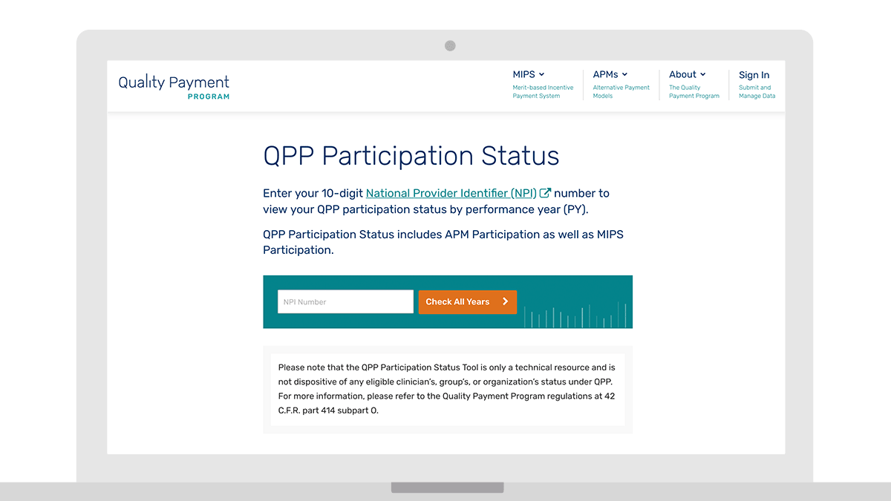
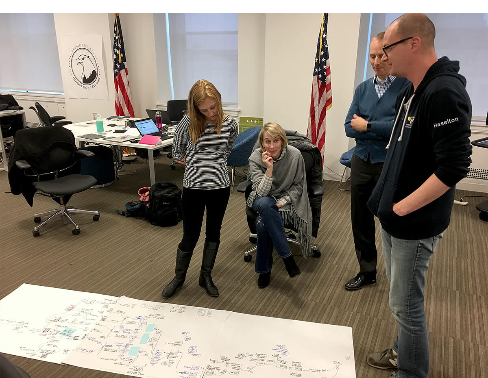

---
# Page template info (DO NOT EDIT)
layout: default
banner_file: banner--people-projects-lg.svg
banner_file_mobile: banner--people-projects-sm.svg
project_page: true

# Carousel (Edit this)
carousel_title: "Implementing a new, quality-based Medicare payment system"
carousel_summary: "The Quality Payment Program API makes it easy for clinicians to submit quality metrics to CMS and for the government to review and return feedback promptly, which leads to greater health outcomes for patients and a more positive experience with value-based care for providers."
carousel_image_name: project-hhs-quality-payment-card.jpg

# Project detail page (Edit this)
title: "Quality Payment Program"
agency: Health and Human Services
permalink: projects/quality-payment-program
project_url: https://qpp.cms.gov
---

## The Challenge

Clinicians and their staff dedicated hundreds of labor hours towards completing and submitting paper forms documenting value-based care quality metrics. They would then submit these forms by fax, which took the Centers for Medicare & Medicaid Services months to return quality feedback and payment for care.

## The Solution

The Quality Payment Program launched in January 2018 as an API empowering clinicians to easily submit Medicare claims. QPP reduces the burden on clinicians to provide healthcare based on outcomes, and decreases the incentive to provide care based on an outdated, fee-for-service model. The Quality Payment Program API makes it easy for clinicians to submit quality metrics to CMS and for the government to review and return feedback promptly, which leads to greater health outcomes for patients and a more positive experience with value-based care for providers.

*Members of our team who worked on QPP meet to discuss Health and Human Services related projects.*

## Press

- [US Digital Service Revamps CMS, QPP User Experience from the Inside Out](https://healthitanalytics.com/news/us-digital-service-revamps-cms-qpp-user-experience-from-the-inside-out)
- [USDS Teams at CMS Spur IT Modernization](https://fedtechmagazine.com/article/2018/06/usds-teams-cms-spur-it-modernization)
- [U.S. Digital Service helps CMS with novel approach to IT modernization](https://federalnewsnetwork.com/ask-the-cio/2018/05/u-s-digital-service-helps-cms-with-novel-approach-to-it-modernization/)
- [Human-centered design meets policy](https://www.politico.com/newsletters/morning-ehealth/2018/08/02/pdmp-market-gains-new-competitor-304100)
- [USDS hands QPP program back to CMS](https://www.politico.com/newsletters/morning-ehealth/2018/04/27/cms-to-make-medicare-advantage-data-available-to-researchers-190036)
