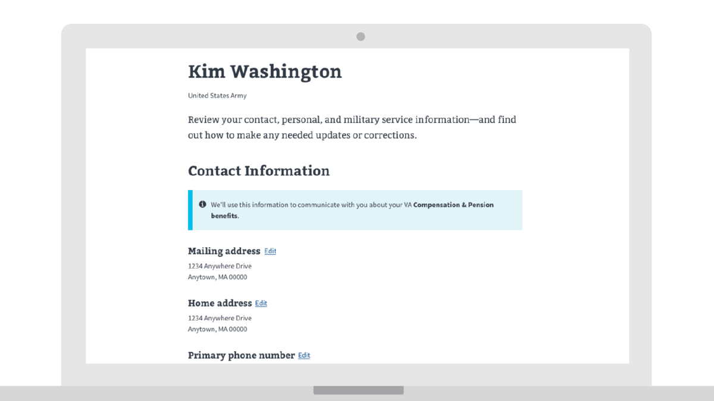

---
# Page template info (DO NOT EDIT)
layout: default
banner_file: banner--people-projects-lg.svg
banner_file_mobile: banner--people-projects-sm.svg
project_page: true

# Carousel (Edit this)
carousel_title: "Personalized Dashboard"
carousel_summary: "A personalized homepage for Veterans on VA.gov."
carousel_image_name: project-va-seal-card.gif
hide: true

# Project detail page (Edit this)
title: "Personalized Dashboard"
agency: Veterans Affairs
permalink: projects/personalized-dashboard
project_url: https://www.va.gov

# The Impact (Edit this)
impact_statement:
  - figure: "40"
    unit: "K"
    description: |-
      Daily views of the personalized profiles

  - figure: "62"
    unit: "K"
    description: |-
      Contact information updates
---

## The Challenge

Many Veterans describe interacting with VA web properties as confusing and frustrating. Information is inconsistent and scattered across different pages or sites, and the experience is often fragmented. Users enter a confusing tangle of benefits portals, logins, passwords, and brands and leave feeling like VA is making it harder for them to access the benefits and care they’ve earned.

## The Solution

When logging into the personalized homepage on [VA.gov](https://www.va.gov/), a Veteran can now see everything they have in-flight at the VA in one place. Through their profile they can also update their contact information in one place and have it populate across VA systems. Since launch in July 2018 and with no promotion of the new functionality, 40,000 views of the personalized profiles are made per day and there have been 62,000 contact information updates.

<blockquote class="pullquote" markdown="1">
I’ve been trying to update my address by calling in but there isn’t a way to update it in the phone tree by dialing in. I think the ability to do it online is great. Because you know if you are waiting they transfer you to disability which isn’t great. They have you waiting 3-4 hours and you’re taking up space for someone who needs healthcare.
 <footer>– a Veteran during a user research session</footer>
</blockquote>
