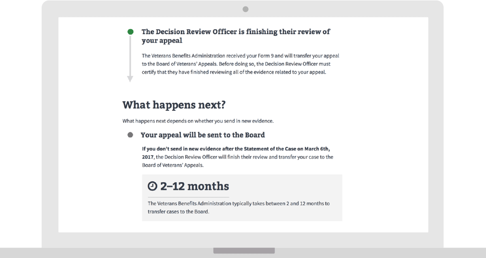
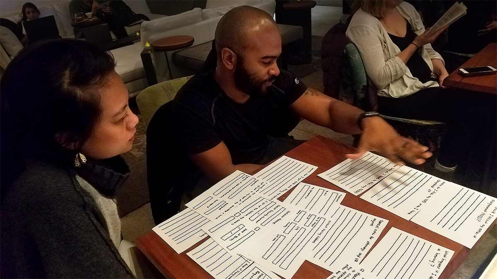

---
# Page template info (DO NOT EDIT)
layout: default
banner_file: banner--people-projects-lg.svg
banner_file_mobile: banner--people-projects-sm.svg
project_page: true

# Carousel (Edit this)
carousel_title: "Disability Appeals Status"
carousel_summary: ""
carousel_image_name: project-va-disability-appeals-card.jpg
hide: true

# Project detail page (Edit this)
title: "Disability Appeals Status"
agency: Veterans Affairs
permalink: projects/disability-appeals-status
project_url: https://www.va.gov/claim-or-appeal-status
---

## The Challenge

Due to the absence of transparency and lack of useful information, it is nearly impossible for Veterans to understand the status of their disability claim appeals. Most cases take years to adjudicate, and the VA has a backlog of more than 400,000 cases awaiting hearings. The previous online status may showing ‘pending’ for up to five years. Some Veterans go so far as to call VA each and every day to check on the status of their case.

## The Solution

Digital Service at VA developed an Appeals Status tool that provides Veterans with transparency into the process. The tool shows Veterans where they are in line to have their case reviewed and adjudicated and helps them understand the impact that different decisions that will have on their case’s status and timeline.

