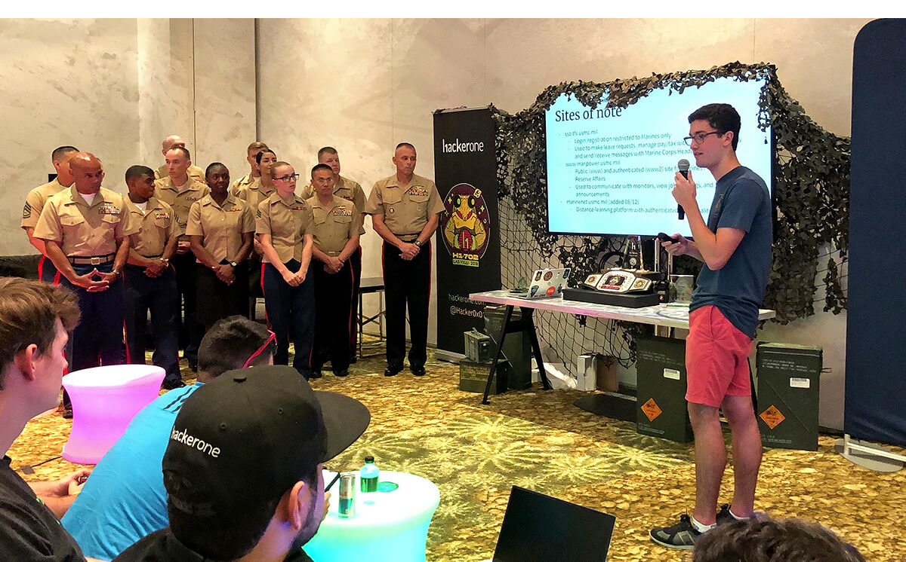

---
# Page template info (DO NOT EDIT)
layout: default
banner_file: banner--people-projects-lg.svg
banner_file_mobile: banner--people-projects-sm.svg
project_page: true

# Carousel (Edit this)
carousel_title: "Hacking the Pentagon"
carousel_summary: "Since kicking off in 2016, the Hack the Pentagon program has engaged ethical hackers across the globe to help the Department of Defense identify and remedy thousands of security vulnerabilities."
carousel_image_name: project-dod-hack-the-pentagon-card.jpg
hide: true

# Project detail page (Edit this)
title: "Hack the Pentagon"
agency: Department of Defense
permalink: projects/hack-the-pentagon
project_url:

# The Impact (Edit this)
impact_statement:
  - figure: "15"
    unit: ""
    description: |-
      Bug bounties held

  - figure: "600+"
    unit: ""
    description: |-
      Global ethical hackers and security researchers

  - figure: ">7"
    unit: "K"
    description: |-
      Vulnerabilities discovered and disclosed
---

## The Challenge

Because our adversaries are more creative than ever when they carry out malicious attacks, it's never been more important to find innovative ways to identify vulnerabilities and strengthen security. The Department of Defense (DoD) spends billions of dollars every year on information security, but had never attempted to address security vulnerabilities using bug bounties, a crowd-sourced model used in the private sector to secure both public-facing and internal assets.

*Ethical hacker [Jack Cable](https://www.facebook.com/unitedstatesdigitalservice/videos/199812990900882/) presents to a group of Marines and fellow hackers at Hack the Marine Corps in Las Vegas. Photo courtesy of HackerOne.*

## The Solution

The Defense Digital Service launched Hack the Pentagon in 2016, the federal government's first bug bounty program. The Hack the Pentagon program has engaged hundreds of ethical hackers around the globe to lawfully discover and disclose vulnerabilities on DoD assets. The DoD's first Vulnerability Disclosure Policy established a 24/7 pathway for security experts to safely disclose vulnerabilities on public-facing DoD websites and applications. DDS has ongoing contracts with security firms HackerOne, Synack, and Bugcrowd to facilitate assessments for DoD components and military services against their respective assets.

<blockquote class="pullquote" markdown="1">
This reinforces the work the Air Force is already doing to strengthen cyber defenses and has created meaningful relationships with skilled researchers that will last for years to come.
 <footer>– Air Force CISO Peter Kim, <a href="https://www.zdnet.com/article/hack-the-air-force-2-0-uncovers-over-100-vulnerabilities/" target="_blank">ZDNet</a>
 </footer>
</blockquote>

*Ethical hackers work together to find and disclose security flaws in Air Force systems during the Hack the Air Force 2.0 bug bounty event in December 2017 in New York City. Photo courtesy of HackerOne.*

## Press
[Bloomberg](https://www.bloomberg.com/news/articles/2017-02-13/pentagon-hires-hackers-to-target-sensitive-internal-systems),
[Business Insider](https://www.businessinsider.com/department-defense-wants-people-hack-pentagon-2018-10),
[CBS News](https://www.youtube.com/watch?v=Q1Wll7HY33U),
[TechCrunch](https://techcrunch.com/2017/01/19/hacking-the-army/),
[Wired](https://www.wired.com/2016/03/pentagon-launches-feds-first-bug-bounty-hackers/),
[Wired](https://www.wired.com/story/hack-the-pentagon-bug-bounty-results/)
