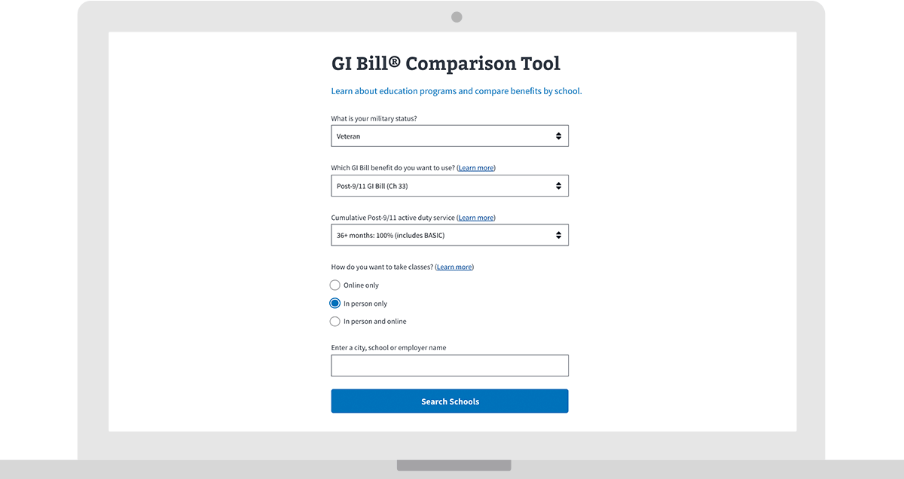

---
# Page template info (DO NOT EDIT)
layout: default
banner_file: banner--people-projects-lg.svg
banner_file_mobile: banner--people-projects-sm.svg
project_page: true

# Carousel (Edit this)
carousel_title: "GI Bill Comparison Tool"
carousel_summary: "Designing with Veterans to make sense of their education and training benefits."
carousel_image_name: project-va-seal-card.gif
hide: true

# Project detail page (Edit this)
title: "GI Bill Comparison Tool"
agency: Veterans Affairs
permalink: projects/gi-bill-comparison-tool
project_url: https://www.va.gov/education/gi-bill/post-9-11/ch-33-benefit

# The Impact (Edit this)
impact_statement:
  - figure: "29"
    unit: "%"
    description: |-
      Increase in use of GI Bill Comparison Tool.
---

## The Challenge

Veterans want to further their education with the benefits they are entitled to from their service. There are many types of education and training programs that offer different benefits, and it can be hard to make sense of which program to use that will best meet their needs.

## The Solution

Digital Service at Veterans Affairs built a user-friendly wizard to help Veterans answer up to four questions and compare education benefits from the different programs. The tool also allows Veterans to compare how benefits at the different schools to which they are considering applying, meet their needs. Leading up to Fall 2018, the tool had a 29% increase in views. Each year during the summer, there is an increase in education tool use.
