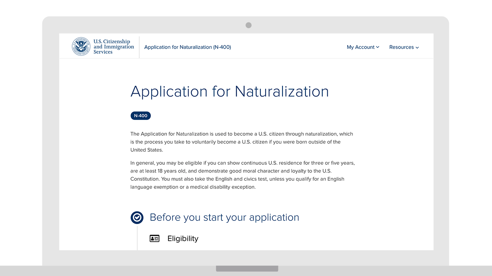
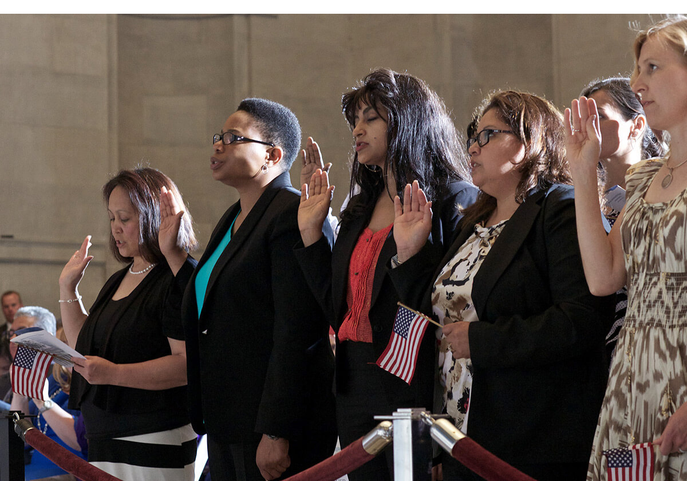

---
# Page template info (DO NOT EDIT)
layout: default
banner_file: banner--people-projects-lg.svg
banner_file_mobile: banner--people-projects-sm.svg
project_page: true

# Carousel (Edit this)
carousel_title: "Modernizing our Immigration System"
carousel_summary: "We partnered with U.S. Citizenship and Immigration Services to move the paper-based immigration process online, providing applicants with a better experience and improving USCIS's processes."
carousel_image_name: project-dhs-n400-card.jpg

# Project detail page (Edit this)
title: "Modernizing our Immigration System"
agency: Department of Homeland Security
permalink: projects/n-400
project_url: https://www.uscis.gov/n-400

# The Impact (Edit this)
impact_statement:
  - figure: "975"
    unit: "K"
    description: |-
      Yearly naturalization applicants

  - figure: "50"
    unit: "%"
    description: |-
      Immigration workload now completed digitally, up from 5%

  - figure: "100"
    unit: "%"
    description: |-
      of new N-400 applications electronically processed since October 2017
---

## The Challenge

U.S. Citizenship and Immigration Services processes millions of immigration requests a year using a paper-based process that results in long waiting periods for applicants who have little visibility into the status of their application or petition. To become a naturalized citizen, an individual had to complete a physical 20-page form, called the N-400. Often, USCIS shipped this form across the country to multiple immigration officers, adjudicators, and clerks to review immigration records, perform interviews, and process background checks.

## The Solution

Since 2014, USDS has supported the release of USCIS’s most critical digital capabilities and services such as ELIS—the case management system that supports processing and adjudication of digitized immigration workloads—and myUSCIS, which allows applicants to apply and track their cases online. In late 2017, USCIS successfully transitioned digital processing of Form N-400 from the legacy CLAIMS4 system to ELIS. Now, all applicants can apply for naturalization online, and USCIS can process the application more efficiently.

*A naturalization ceremony taking place at the National Archives in Washington, D.C., with Michelle Obama in attendance (photo courtesty of U.S. National Archives).*
